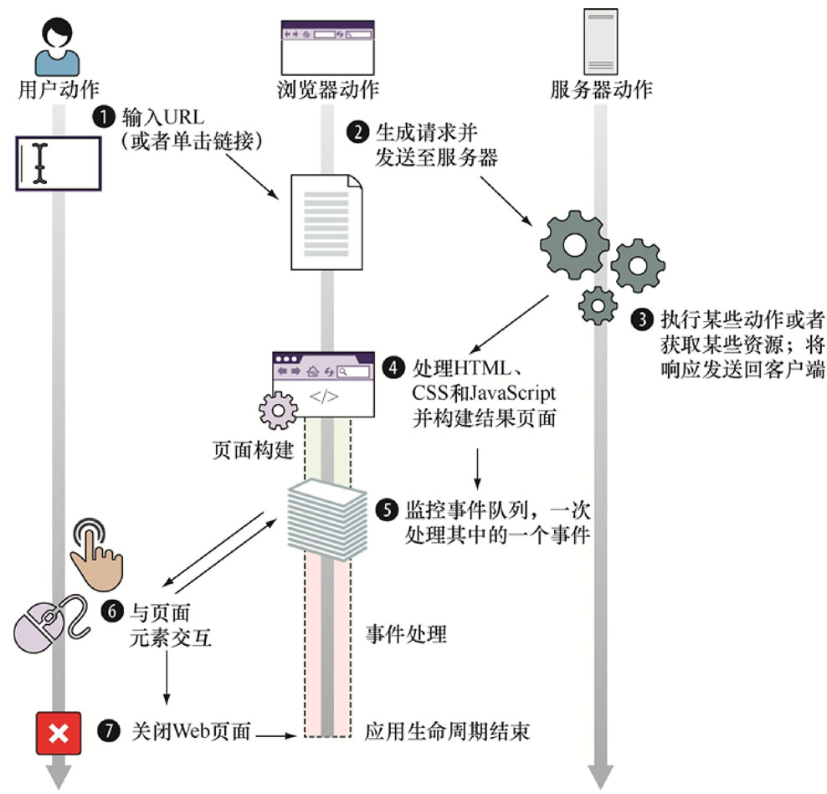

# Introduction

前端开发应用领域广泛：web开发、移动web开发、APP开发、小程序开发、服务端开发等

## 前端开发主要技术介绍

| 技术 | 介绍 |
| :--- | :--- |
| HTML5 | 搭建网页结构的语言 |
| CSS3 | 层叠演示表，美化网页的语言 |
| JavaScript | 增加网页互动功能的语言 |
| Vue.js/React.js | 前端框架，采用模块化开发、数据驱动、声明式编程 |

|        | 语言       | 功能                             |
| ------ | ---------- | -------------------------------- |
| 结构层 | HTML       | 搭建结构、放置部件、描述语义     |
| 样式层 | CSS        | 美化页面、实现布局               |
| 行为层 | JavaScript | 实现交互效果、数据收发、表单验证 |

## Web应用的生命周期

从用户发送页面请求，到用户与页面进行交互，最后用户关闭页面，这整一个流程构成了web应用的生命周期。当浏览器接收了响应（序号4）时，web应用的生命周期开始，生命周期主要由两个阶段构成：页面构建、事件处理。当用户关掉页面（序号7），web应用的生命周期结束。

### 页面构建

当Web应用能被展示或交互之前，其页面必须根据服务器获取的响应（通常是HTML、CSS和JavaScript代码）来构建。页面构建阶段的目标是建立Web应用的UI，其主要包括两个步骤：

1. 解析HTML代码并构建文档对象模型（DOM）；

2. 执行JavaScript代码。

步骤1会在浏览器处理HTML节点的过程中执行，步骤二会在HTML解析到一种特殊节点——脚本节点（包含或引用JavaScript代码的节点）时执行。

#### html解析和DOM构建

当浏览器接收到html代码，浏览器就会开始解析html并构建DOM。每个html元素会被当做一个节点，除了html根节点，其余节点都有且仅有一个父节点，这样树状的节点关系形成了DOM树。

浏览器构建节点，可能与html代码不一致，浏览器会修复html代码的问题，如标签没有闭合、标签位置错误。

当浏览器解析到脚本元素时，会停止DOM构建，开始执行js代码。

#### 执行js代码

js代码由浏览器的JavaScript引擎执行，nodejs中就使用了Chrome的V8引擎。浏览器提供了全局对象给js引擎，使得引擎能够通过全局对象的api改变页面内容。

浏览器暴露给JavaScript引擎的主要全局对象是window对象，它代表了包含着一个页面的窗口。window对象是获取所有其他全局对象、全局变量（甚至包含用户定义对象）和浏览器API的访问途径。全局window对象最重要的属性是document，它代表了当前页面的DOM。

通过document，js代码可以操作已构建的DOM节点，无法操作还没构建的节点。因此脚本元素一般放在页面底部。

当js引擎执行到js代码的最后一行，浏览器会继续构建DOM。

### 事件处理