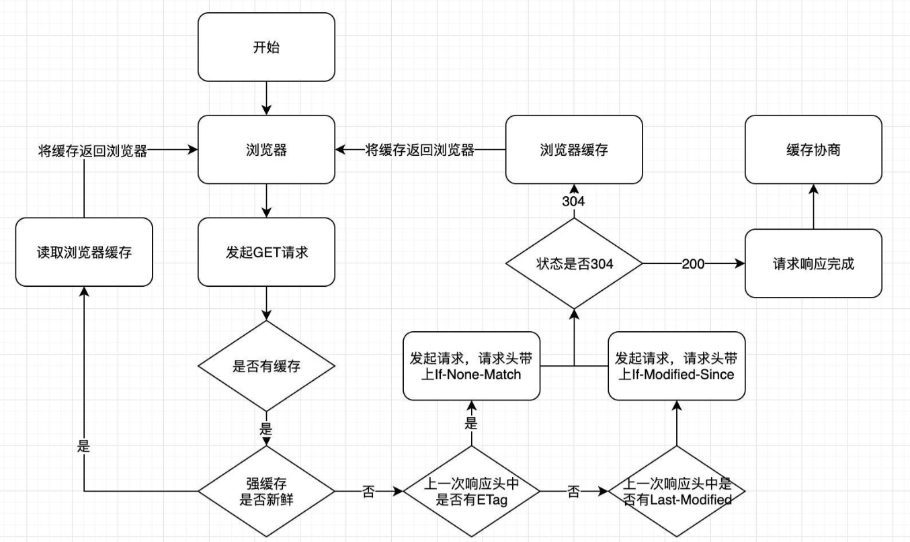
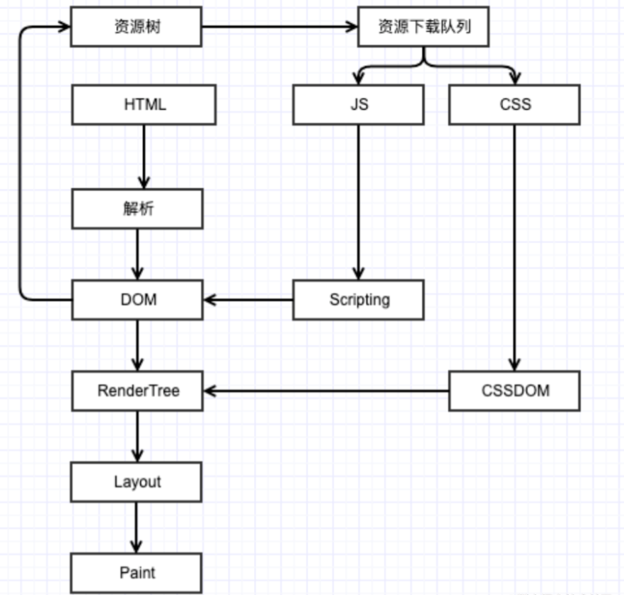

# 网络

## 从输入URL到页面展示

（1）**解析URL：** 首先会对 URL 进行解析，分析所需要使用的传输协议和请求的资源的路径。如果输入的 URL 中的协议或者主机名不合法，将会把地址栏中输入的内容传递给搜索引擎。如果没有问题，浏览器会检查 URL 中是否出现了非法字符，如果存在非法字符，则对非法字符进行转义后再进行下一过程。

（2）**缓存判断：** 浏览器会判断所请求的资源是否命中强缓存，命中则将资源返回，没命中再判断协商缓存，都没命中进入下一步。

（3）**DNS解析：** 该步是获取输入的 URL 中的域名的 IP 地址。这一过程分为递归查询和迭代查询。递归查询是判断缓存是否命中，从浏览器缓存、系统缓存、路由器缓存、ISP缓存、本地DNS缓存依次判断，命中则返回。

迭代查询是本地 DNS 服务器向各级域名服务器发起请求的过程。首先向根域名服务器发起请求，获得负责的顶级域名服务器的地址后，再向顶级域名服务器请求，然后获得负责的权威域名服务器的地址后，再向权威域名服务器发起请求，最终获得域名的 IP 地址后，本地 DNS 服务器再将这个 IP 地址返回给请求的用户。

如果网站有多个不同服务器资源，可以采用DNS预解析，提前解析。

`<link rel="dns-prefetch" href="//">`

（4）**获取MAC地址：** 当浏览器得到 IP 地址后，数据传输还需要知道目的主机 MAC 地址，因为应用层下发数据给传输层，TCP 协议会指定源端口号和目的端口号，然后下发给网络层。网络层会将本机地址作为源地址，获取的 IP 地址作为目的地址。然后将下发给数据链路层，数据链路层的发送需要加入通信双方的 MAC 地址，本机的 MAC 地址作为源 MAC 地址，目的 MAC 地址需要分情况处理。通过将 IP 地址与本机的子网掩码相与，可以判断是否与请求主机在同一个子网里，如果在同一个子网里，可以使用 APR 协议获取到目的主机的 MAC 地址，如果不在一个子网里，那么请求应该转发给网关，由它代为转发，此时同样可以通过 ARP 协议来获取网关的 MAC 地址，此时目的主机的 MAC 地址应该为网关的地址。

（5）**TCP三次握手：** 下面是 TCP 建立连接的三次握手的过程，首先客户端向服务器发送一个 SYN 连接请求报文段和一个随机序号，服务端接收到请求后向客户端发送一个 SYN ACK报文段，确认连接请求，并且也向客户端发送一个随机序号。客户端接收服务器的确认应答后，进入连接建立的状态，同时向服务器也发送一个ACK 确认报文段，服务器端接收到确认后，也进入连接建立状态，此时双方的连接就建立起来了。

（6）**HTTPS握手：** 如果使用的是 HTTPS 协议，在通信前还存在 TLS 的一个四次握手的过程。首先由客户端向服务器端发送使用的协议的版本号、一个随机数和可以使用的加密方法。服务器端收到后，确认加密的方法，也向客户端发送一个随机数和自己的数字证书。客户端收到后，首先检查数字证书是否有效，如果有效，则再生成一个随机数，并使用证书中的公钥对随机数加密，然后发送给服务器端，并且还会提供一个前面所有内容的 hash 值供服务器端检验。服务器端接收后，使用自己的私钥对数据解密，同时向客户端发送一个前面所有内容的 hash 值供客户端检验。这个时候双方都有了三个随机数，按照之前所约定的加密方法，使用这三个随机数生成一把秘钥，以后双方通信前，就使用这个秘钥对数据进行加密后再传输。

（7）**返回数据：** 当页面请求发送到服务器端后，服务器端会返回一个 html 文件作为响应，浏览器接收到响应后，开始对 html 文件进行解析，开始页面的渲染过程。

（8）**页面渲染：** 浏览器首先会根据 html 文件构建 DOM 树，根据解析到的 css 文件构建 CSSOM 树，如果遇到 script 标签，则判断是否含有 defer 或者 async 属性，要不然 script 的加载和执行会造成页面的渲染的阻塞。当 DOM 树和 CSSOM 树建立好后，根据它们来构建渲染树。渲染树构建好后，会根据渲染树来进行布局。布局完成后，最后使用浏览器的 UI 接口对页面进行绘制。这个时候整个页面就显示出来了。

（9）**TCP四次挥手：** 最后一步是 TCP 断开连接的四次挥手过程。若客户端认为数据发送完成，则它需要向服务端发送连接释放请求。服务端收到连接释放请求后，会告诉应用层要释放 TCP 链接。然后会发送 ACK 包，并进入 CLOSE_WAIT 状态，此时表明客户端到服务端的连接已经释放，不再接收客户端发的数据了。但是因为 TCP 连接是双向的，所以服务端仍旧可以发送数据给客户端。服务端如果此时还有没发完的数据会继续发送，完毕后会向客户端发送连接释放请求，然后服务端便进入 LAST-ACK 状态。客户端收到释放请求后，向服务端发送确认应答，此时客户端进入 TIME-WAIT 状态。该状态会持续 2MSL（最大段生存期，指报文段在网络中生存的时间，超时会被抛弃） 时间，若该时间段内没有服务端的重发请求的话，就进入 CLOSED 状态。当服务端收到确认应答后，也便进入 CLOSED 状态。

### DNS解析

DNS提供的是一种主机名到 IP 地址的转换服务，就是我们常说的域名系统，是一个由分层的 DNS 服务器组成的分布式数据库，是定义了主机如何查询这个分布式数据库的方式的应用层协议。

DNS占用53号端口，同时使用TCP和UDP协议。

* 在区域传输的时候使用TCP协议
* 在域名解析的时候使用UDP协议

本地 DNS 服务器也会先检查是否存在缓存，如果没有就会先向根域名服务器发起请求，获得负责的顶级域名服务器的地址后，再向顶级域名服务器请求，然后获得负责的权威域名服务器的地址后，再向权威域名服务器发起请求，最终获得域名的 IP 地址后，本地 DNS 服务器再将这个 IP 地址返回给请求的用户。用户向本地 DNS 服务器发起请求属于递归请求，本地 DNS 服务器向各级域名服务器发起请求属于迭代请求。

## HTTP

### 特点

1. 支持客户/服务器模式。
2. 简单快速客户向服务器请求服务时，只需传送请求方法和路径。请求方法常用的有 GET、HEAD、POST。每种方法规定了客户与服务器联系的类型不同。由于 HTTP协议简单，使得HTTP服务器的程序规模小，因而通信速度很快。
3. 灵活：HTTP允许传输任意类型的数据对象。正在传输的类型由Content-Type（Content-Type是HTTP包中用来表示内容类型的标识）加以标记。
4. 无连接：无连接的含义是限制每次连接只处理一个请求。服务器处理完客户的请求，并收到客户的应答后，即断开连接。采用这种方式可以节省传输时间。
5. 无状态：HTTP协议是无状态协议。无状态是指协议对于事务处理没有记忆能力。缺少状态意味着如果后续处理需要前面的信息，则它必须重传，这样可能导致每次连接传送的数据量增大。另一方面，在服务器不需要先前信息时它的应答就较快。

### 请求

#### Get和Post区别

* 应用场景，一般 Get 请求用于对服务器资源不会产生影响的场景， Post请求用于对服务器资源会产生影响的场景
* 缓存，Get可以被缓存，Post不可以
* 请求体，Get无请求体，Post有
* 安全性，Get请求参数会被保留在历史记录中
* 请求长度，浏览器对url长度有限制，get发送数据有限
* 参数类型，Post支持传递多种数据类型

#### 报文结构

请求报文有4部分组成:

- 请求行，包括请求方法字段、URL字段、HTTP协议版本字段，用空格隔开
- 请求头部，由键值对构成
- 空行
- 请求体

### 响应

#### 状态码

| 类别 | 原因                            | 描述                       |
| :--- | :------------------------------ | :------------------------- |
| 1xx  | Informational(信息性状态码)     | 接受的请求正在处理         |
| 2xx  | Success(成功状态码)             | 请求正常处理完毕           |
| 3xx  | Redirection(重定向状态码)       | 需要进行附加操作一完成请求 |
| 4xx  | Client Error (客户端错误状态码) | 服务器无法处理请求         |
| 5xx  | Server Error(服务器错误状态码)  | 服务器处理请求出错         |

##### 200 OK

200 OK表示客户端发来的请求被服务器端正常处理了。

##### 204 No Content

该状态码表示客户端发送的请求已经在服务器端正常处理了，但是没有返回的内容，响应报文中不包含实体的主体部分。

##### 206 Partial Content

该状态码表示客户端进行了范围请求，而服务器端执行了这部分的 GET 请求。

##### 301 Moved Permanently

该状态码表示请求的资源已经被分配了新的 URI，以后应使用资源指定的 URI。新的 URI 会在 HTTP 响应头中的 Location 首部字段指定。若用户已经把原来的URI保存为书签，此时会按照 Location 中新的URI重新保存该书签。同时，搜索引擎在抓取新内容的同时也将旧的网址替换为重定向之后的网址。

##### 302 Found

临时重定向。

##### 303 See Other

该状态码表示由于请求对应的资源存在着另一个 URI，应使用 GET 方法定向获取请求的资源。

##### 304 Not Modified

该状态码表示客户端发送附带条件的请求时，服务器端允许请求访问资源，但未满足条件的情况。

##### 400 Bad Request

该状态码表示请求报文中存在语法错误。当错误发生时，需修改请求的内容后再次发送请求。

##### 401 Unauthorized

该状态码表示发送的请求需要有通过 HTTP 认证(BASIC 认证、DIGEST 认证)的认证信息。若之前已进行过一次请求，则表示用户认证失败

##### 403 Forbidden

该状态码表明请求资源的访问被服务器拒绝了，服务器端没有必要给出详细理由，但是可以在响应报文实体的主体中进行说明。

##### 404 Not Found

该状态码表明服务器上无法找到请求的资源。除此之外，也可以在服务器端拒绝请求且不想说明理由时使用。

##### 405 Method Not Allowed

该状态码表示客户端请求的方法虽然能被服务器识别，但是服务器禁止使用该方法。

##### 408 Request Time-out

服务器等待客户端发送的请求时间过长，超时

##### 429 Too Many Request

在一定的时间内用户发送了太多的请求,即超出了“频次限制”。

##### 500 Internal Server Error

该状态码表明服务器端在执行请求时发生了错误。也有可能是 Web 应用存在的 bug 或某些临时的故障。

##### 502 Bad Gateway

该状态码表明扮演网关或代理角色的服务器，从上游服务器中接收到的响应是无效的。

##### 503 Service Unavailable

该状态码表明服务器暂时处于超负载或正在进行停机维护，现在无法处理请求。

##### 509 Bandwidth Limit Exceeded

服务器达到带宽限制

### 版本

#### HTTP0.9

* 请求方法，只有GET
* 响应类型，只有超文本
* 格式，没有header
* 过程，服务器发送后关闭TCP连接

#### HTTP1.0

* 请求方法，增加post
* 格式，增加status code和header
* 响应类型，支持其他类型数据传输

* 连接方面，默认采用非持久连接
* 资源请求方面，http1.0 不支持断点续传
* 缓存方面，http1.0 采用if-Modified-Since/Last-Modified、Expires判断缓存

#### HTTP1.1

* 连接方面，默认采用持久连接
* 资源请求方面，新增range字段，允许只请求资源某个部分，返回码206，支持断点续传
* 缓存方面，新增Etag/if-None-Match、cache-control
* 新增host字段，支持一台服务器上共享IP的多个虚拟主机作为网站
* 新增请求方法，PUT、HEAD、OPTIONS

#### HTTP2.0

* 二进制协议，头信息和数据体都是二进制，HTTP1.1 头信息是文本
* 多路复用，复用TCP连接，在一个连接中，客户端和服务器可以同时发送多个请求或响应，不需要按照顺序
* 数据流，因为 HTTP/2 的数据包是不按顺序发送的，同一个连接里面连续的数据包，可能属于不同的请求。因此，必须要对数据包做标记，指出它属于哪个请求。
* 头信息压缩，一方面，头信息使用 gzip 或 compress 压缩后再发送；另一方面，客户端和服务器同时维护一张头信息表，所有字段都会存入这个表，生成一个索引号，以后就不发送同样字段了，只发送索引号。
* 服务器推送，允许服务器未经请求，主动向客户端发送资源

#### HTTP3.0

HTTP/3基于UDP协议实现了类似于TCP的多路复用数据流、传输可靠性等功能，这套功能被称为QUIC协议。

* 流量控制、拥塞控制、数据包重传
* 集成TLS加密
* 多路复用
* 快速握手

### HTTPS

#### 握手

1. 客户端向服务器发起请求，请求中包含使用的协议版本号、生成的一个随机数、以及客户端支持的加密方法。
2. 服务器端接收到请求后，确认双方使用的加密方法、并给出服务器的证书、以及一个服务器生成的随机数。
3. 客户端确认服务器证书有效后，生成一个新的随机数，并使用数字证书中的公钥，加密这个随机数，然后发给服务器。并且还会提供一个前面所有内容的 hash 的值，用来供服务器检验。
4. 服务器使用自己的私钥，来解密客户端发送过来的随机数。并提供前面所有内容的 hash 值来供客户端检验。
5. 客户端和服务器端根据约定的加密方法使用前面的三个随机数，生成对话秘钥，以后的对话过程都使用这个秘钥来加密信息。

#### 区别

1. 客户端向服务端发送 `Client Hello` 消息，其中携带客户端支持的协议版本、加密算法、压缩算法以及客户端生成的随机数；

2. 服务端收到客户端支持的协议版本、加密算法等信息后；

   1. 向客户端发送 `Server Hello` 消息，并携带选择特定的协议版本、加密方法、会话 ID 以及服务端生成的随机数；

   2. 向客户端发送 `Certificate` 消息，即服务端的证书链，其中包含证书支持的域名、发行方和有效期等信息；

   3. 向客户端发送 `Server Key Exchange` 消息，传递公钥以及签名等信息；

   4. 向客户端发送可选的消息 `Certificate Request`，验证客户端的证书；

   5. 向客户端发送 `Server Hello Done` 消息，通知服务端已经发送了全部的相关信息；

3. 客户端收到服务端的协议版本、加密方法、会话 ID 以及证书等信息后，验证服务端的证书；

   1. 向服务端发送 `Client Key Exchange` 消息，包含使用服务端公钥加密后的随机字符串，即预主密钥（`Pre Master Secret`）；

   2. 向服务端发送 `Change Cipher Spec` 消息，通知服务端后面的数据段会加密传输；

   3. 向服务端发送 `Finished` 消息，其中包含加密后的握手信息；

4. 收到 `Change Cipher Spec` 和 `Finished` 消息后；

   1. 向客户端发送 `Change Cipher Spec` 消息，通知客户端后面的数据段会加密传输；
   2. 向客户端发送 `Finished` 消息，验证客户端的 `Finished` 消息并完成 TLS 握手；

#### 工作原理

HTTPS是一种利用SSL/TLS层加密从而实现安全通信的传输协议。

##### TLS/SSL

TLS 握手的关键在于利用通信双方生成的随机字符串和服务端的证书公钥生成一个双方经过协商后的对称密钥。

TLS/SSL功能实现主要依赖三类基本算法：**散列函数hash**、**对称加密**、**非对称加密**。这三类算法的作用如下：

- 基于散列函数验证信息的完整性
- 对称加密算法采用协商的秘钥对数据加密
- 非对称加密实现身份认证和秘钥协商

##### 数字证书

服务端用Hash算法对公钥和一些信息进行加密形成信息摘要，让有公信力的认证中心（简称 CA ）用它的私钥对消息摘要加密，形成签名。最后将原始的信息和签名合在一起，称为数字证书。

当接收方收到数字证书的时候，先根据原始信息使用同样的 Hash 算法生成一个摘要，然后使用公证处的公钥来对数字证书中的摘要进行解密，最后将解密的摘要和生成的摘要进行对比，就能发现得到的信息是否被更改了。

### 缓存策略

HTTP 缓存分为 2 种，一种是强缓存，另一种是协商缓存。主要作用是可以加快资源获取速度，提升用户体验，减少网络传输，缓解服务端的压力。

#### 强缓存

不需要发送请求到服务端，直接读取浏览器本地缓存，在 Chrome 的 Network 中显示的 HTTP 状态码是 200 ，在 Chrome 中，强缓存又分为 Disk Cache (存放在硬盘中)和 Memory Cache (存放在内存中)，存放的位置是由浏览器控制的。是否强缓存由 Expires、Cache-Control 和 Pragma 3 个 Header 属性共同来控制。

##### Expires

Expires 的值是一个 HTTP 日期，在浏览器发起请求时，会根据系统时间和 Expires 的值进行比较，如果系统时间超过了 Expires 的值，缓存失效。

当系统时间和服务器时间不一致的时候，会有缓存有效期不准的问题。Expires 的优先级在三个 Header 属性中是最低的。

##### Cache-Control

Cache-Control 是 HTTP/1.1 中新增的属性，在请求头和响应头中都可以使用，常用的属性值如有：

- max-age：单位是秒，缓存时间计算的方式是距离发起的时间的秒数，超过间隔的秒数缓存失效
- no-cache：不使用强缓存，需要与服务器验证缓存是否新鲜
- no-store：禁止使用缓存（包括协商缓存），每次都向服务器请求最新的资源
- private：专用于个人的缓存，中间代理、CDN 等不能缓存此响应
- public：响应可以被中间代理、CDN 等缓存
- must-revalidate：在缓存过期前可以使用，过期后必须向服务器验证

##### Pragma

Pragma 只有一个属性值，就是 no-cache ，效果和 Cache-Control 中的 no-cache 一致，不使用强缓存，需要与服务器验证缓存是否新鲜，在 3 个头部属性中的优先级最高。

#### 协商缓存

当浏览器的强缓存失效的时候或者请求头中设置了不走强缓存，并且在请求头中设置了If-Modified-Since 或者 If-None-Match 的时候，会将这两个属性值到服务端去验证是否命中协商缓存。

##### ETag/If-None-Match

ETag/If-None-Match 的值是一串 hash 码，代表的是一个资源的标识符，当服务端的文件变化的时候，它的 hash码会随之改变，通过请求头中的 If-None-Match 和当前文件的 hash 值进行比较，如果相等则表示命中协商缓存。

ETag 又有强弱校验之分，如果 hash 码是以 "W/" 开头的一串字符串，说明此时协商缓存的校验是弱校验的，只有服务器上的文件差异（根据 ETag 计算方式来决定）达到能够触发 hash 值后缀变化的时候，才会真正地请求资源，否则返回 304 并加载浏览器缓存。

##### Last-Modified/If-Modified-Since

Last-Modified/If-Modified-Since 的值代表的是文件的最后修改时间，第一次请求服务端会把资源的最后修改时间放到 Last-Modified 响应头中，第二次发起请求的时候，请求头会带上上一次响应头中的 Last-Modified 的时间，并放到 If-Modified-Since 请求头属性中，服务端根据文件最后一次修改时间和 If-Modified-Since 的值进行比较，如果相等，返回 304 ，并加载浏览器缓存。

1. 某些情况下服务器无法获取资源的最后修改时间  
2. 资源的最后修改时间变了但是内容没变，使用ETag可以正确缓存 
3. 如果资源修改非常频繁，在秒以下的时间进行修改，Last-Modified只能精确到秒

## TCP

### TCP与UDP区别

TCP和UDP都是传输层协议。

TCP面向连接、可靠、基于字节流，能够提供可靠的数据传输服务。UDP面向无连接，只具备发送数据的能力，不保证数据传输的可靠性。

TCP传输的数据是字节流方式，从而能够进行分片传输，保证数据的有序性，UDP以报文方式整个传输，这导致TCP报文首部字节数多于UDP，UDP报文形式形成消息边界，不会出现粘包问题，而TCP可能会。

TCP可靠性基于其面向连接的特性，在发送数据前双方建立连接，也就是TCP三次握手。而这使得TCP通讯是1对1。UDP无连接，可以实现广播通讯。

为了保证TCP可靠性，接收方需要返回应答报文表示是否接收到发送方的请求报文，如果超过一定时间或者应答报文不符合预期，发送方会重新发送，从而保证数据一定能被接收。

网络拥堵会增加报文的丢失率，重传又会增加拥堵程度。为了应对这个问题，TCP使用拥塞控制、流量控制等限制发送窗口大小。

|              | UDP                                        | TCP                                                  |
| :----------- | :----------------------------------------- | ---------------------------------------------------- |
| 是否连接     | 无连接                                     | 面向连接                                             |
| 是否可靠     | 不可靠传输，不使用流量控制和拥塞控制       | 可靠传输（数据顺序和正确性），使用流量控制和拥塞控制 |
| 连接对象个数 | 支持一对一，一对多，多对一和多对多交互通信 | 只能是一对一通信                                     |
| 传输方式     | 面向报文                                   | 面向字节流                                           |
| 首部开销     | 首部开销小，仅8字节                        | 首部最小20字节，最大60字节                           |
| 适用场景     | 适用于实时应用，例如视频会议、直播         | 适用于要求可靠传输的应用，例如文件传输               |

### TCP 三次握手的过程？

从最开始双方都处于`CLOSED`状态。然后服务端开始监听某个端口，进入了`LISTEN`状态。

然后客户端主动发起连接，发送 SYN，seq = x, 自己变成了`SYN-SENT`状态。

服务端接收到，返回`SYN`、seq = y、ack = x + 1，自己变成了`SYN-REVD`。

之后客户端再发送ack = y + 1, seq = x + 1给服务端，自己变成了`ESTABLISHED`状态；服务端收到`ACK`之后，也变成了`ESTABLISHED`状态。

### 为什么是三次而不是两次、四次？

TCP三次握手的目的建立连接，TCP协议RFC793明确连接是用于保证可靠性和流控制机制的信息，包括 Socket、序列号以及窗口大小。

TCP三次握手，才能保证阻止重复历史连接的初始化、初始化收发双方的序列号。

如果通信双方的通信次数只有两次，那么发送方一旦发出建立连接的请求之后它就没有办法撤回这一次请求，如果在网络状况复杂或者较差的网络中，发送方连续发送多次建立连接的请求，如果 TCP 建立连接只能通信两次，那么接收方只能选择接受或者拒绝发送方发起的请求，它并不清楚这一次请求是不是由于网络拥堵而早早过期的连接。

使用三次握手和 `RST` 控制消息将是否建立连接的最终控制权交给了发送方，因为只有发送方有足够的上下文来判断当前连接是否是错误的或者过期的。

### TCP四次挥手

刚开始双方处于`ESTABLISHED`状态。

客户端要断开了，向服务器发送 `FIN` 报文，seq = x。发送后客户端变成了`FIN-WAIT-1`状态。

服务端接收后向客户端确认，ack = x + 1变成了`CLOSED-WAIT`状态。

客户端接收到了服务端的确认，变成了`FIN-WAIT2`状态。

随后，服务端向客户端发送`FIN`，ack = x + 1, seq = y自己进入`LAST-ACK`状态，

客户端收到服务端发来的`FIN`后，自己变成了`TIME-WAIT`状态，然后发送 ack = y + 1给服务端。

`TIME-WAIT`持续时间2 个 `MSL`，在这段时间内如果客户端没有收到服务端的重发请求，那么表示 ACK 成功到达，挥手结束，否则客户端重发 ACK。

如果不等待，当ACK丢失，服务端超时重传，此时客户端无法应答，造成服务端资源浪费，同时若客户端的端口此时刚好被新的应用占用，那么就接收到了无用数据包，造成数据包混乱。

### TCP粘包

TCP粘包是由于使用者无法正确区分消息边界导致的多个消息合并在一起而无法区分的问题。

TCP粘包直接原因有两点：

1. 发送方使用Nagle算法合并小数据包后发送
2. 接收方接收到数据包，应用程序没有及时取走，新接收的数据包与之粘连在一起

关闭Nagle算法并不能解决粘包问题，解决粘包问题解决方式：应用程序对待发送的数据添加识别消息边界信息，接收后再根据消息边界信息拆包。

> 在 Nagle 算法开启的状态下，数据包在以下两个情况会被发送：
>
> * 如果包长度达到`MSS`（或含有`Fin`包），立刻发送，否则**等待**下一个包到来；如果下一包到来后两个包的总长度超过`MSS`的话，就会进行拆分发送；
> * 等待超时（一般为`200ms`），第一个包没到`MSS`长度，但是又迟迟等不到第二个包的到来，则立即发送。

UDP并不会在使用中出现粘包现象，因为UDP是面向报文的，对于每个报文UDP会添加头部信息，这就形成了消息边界。

### 半连接和SYN Flood攻击

服务端在内部维护两个队列：半连接队列、全连接队列。

三次握手时，当客户端发送SYN，服务端接收并回复后，该连接会进入半连接队列。

三次握手时，当客户端发送ACK，服务端接收到，将连接从半连接队列转移到全连接队列。

SYN Flood 属于典型的 DoS/DDoS 攻击。其攻击的原理很简单，就是用客户端在短时间内伪造大量不存在的 IP 地址，并向服务端疯狂发送`SYN`。

后果

1. 半连接队列会被占满，无法处理正常请求
2. 服务端会重传ACK，占用资源

应对

1. 扩大半连接队列容量
2. 减少ACK重传次数
3. 使用SYN Cookie 技术，在服务端接收到`SYN`后不立即分配连接资源，而是根据这个`SYN`计算出一个Cookie，连同第二次握手回复给客户端，在客户端回复`ACK`的时候带上这个`Cookie`值，服务端验证 Cookie 合法之后才分配连接资源

## 网络安全

### XSS

`XSS`的全称是 `Cross-Site Scripting`，跨站脚本攻击。是指通过利用网页开发时留下的漏洞，通过巧妙的方法注入恶意指令代码到网页，使用户加载并执行攻击者恶意制造的网页程序。

#### 非持久型

非持久型XSS的特点在于即时性，它不需要存储在服务器中，通过巧妙地构造一个带恶意代码的URL，然后引导用户点击访问，即可实现攻击。

1. 如果该URL由后端处理，则又称反射型
2. 如果该URL仅在前端处理，则称DOM型

#### 持久型

攻击代码通过某种方式存储在服务器中，只要用户打开相应页面就会遭受攻击。

#### 防御方式

##### 阻止恶意代码执行

1. 使用HTML转义， 对所有外部插入的代码都应该做一次转义
2. 开启CSP防护，内容安全策略（CSP）的设计就是为了防御XSS攻击的，通过在HTTP头部中设置`Content-Security-Policy`,就可以配置该策略

CSP 本质上就是建⽴⽩名单，由浏览器进行拦截。开发者明确告诉浏览器哪些外部资源可以加载和执⾏。我们只需要配置规则，如何拦截是由浏览器⾃⼰实现的。我们可以通过这种⽅式来尽量减少 XSS 攻击。

Content-Security-Policy: default-src 'self' -所有内容均来自站点的同一个源（不包括其子域名）

Content-Security-Policy: default-src 'self' *.trusted.com-允许内容来自信任的域名及其子域名 (域名不必须与CSP设置所在的域名相同)

Content-Security-Policy: default-src xxxx.com-该服务器仅允许通过HTTPS方式并仅从xxxx.com域名来访问文档

##### 危害

对于所有包含敏感信息的cookie，都应该在服务端对其设置`httpOnly`，被设置了`httpOnly`的cookie字段无法通过JS获取

### CSRF

CSRF（Cross-site request forgery）中文名称跨站请求伪造，攻击者诱导受害者进入第三方网站，在第三方网站中，向被攻击网站发送跨站请求。利用受害者在被攻击网站已经获取的注册凭证，绕过后台的用户验证，达到冒充用户对被攻击的网站执行某项操作的目的。

- 发送GET请求，可以使用`img`标签，因为该标签链接不受浏览器的跨域限制。
- 发送POST请求，可以使用CORS方法

#### 防御方式

加大三方网站对身份凭据的获取难度，以及完善服务端身份凭证的校验方式，能够有效防御CSRF。

##### SameSite Cookie

浏览器针对cookie提供了`SameSite`的属性，该属性表示 Cookie 不随着跨域请求发送。

##### 同源检测

`Referer`和`Origin`是http请求的头部字段之一，用来标志该请求是从哪个页面链接过来的。因此后台服务器可以通过检查该字段是否是来自自己的网站链接，来避免第三方网站发起CSRF攻击。

Origin不存在：

* IE11同源策略

   IE 11 不会在跨站CORS请求上添加Origin标头，Referer头将仍然是唯一的标识。

* 302重定向

  在302重定向之后Origin不包含在重定向的请求中，因为Origin可能会被认为是其他来源的敏感信息。

在部分情况下，攻击者可以隐藏，甚至修改自己请求的Referer。

设置Referrer Policy的方法有三种：

1. 在CSP设置
2. 页面头部增加meta标签
3. a标签增加referrerpolicy属性

##### CSRF Token

后端生成一个CSRF Token，通常保存在Session中，页面提交的请求携带这个Token，服务器验证Token是否正确

##### 二次验证

对于一些有危险性的操作，增加二次验证

##### 双重Cookie验证

利用CSRF攻击不能获取到用户Cookie的特点，我们可以要求Ajax和表单请求携带一个Cookie中的值。后端接口验证Cookie中的字段与URL参数中的字段是否一致，不一致则拒绝。

优点

* 无需使用Session，适用面更广，易于实施。
* Token储存于客户端中，不会给服务器带来压力。
* 相对于Token，实施成本更低，可以在前后端统一拦截校验，而不需要一个个接口和页面添加。

缺点

* Cookie中增加了额外的字段。
* 如果有其他漏洞（例如XSS），攻击者可以注入Cookie，那么该防御方式失效。
* 难以做到子域名的隔离。
* 为了确保Cookie传输安全，采用这种防御方式的最好确保用整站HTTPS的方式，如果还没切HTTPS的使用这种方式也会有风险。

### 点击劫持

点击劫持是⼀种视觉欺骗的攻击手段。

攻击者将需要攻击的网站通过iframe嵌套的方式嵌入自己的网页中，并将 iframe 设置为透明，在页面中透出⼀个按钮诱导⽤户点击。

#### 防御方式

1. 为 iframe 设置 sandbox 属性，通过它可以对iframe的行为进行各种限制，充分实现“最小权限“原则 

2. 服务端设置 X-Frame-Options Header头，拒绝页面被嵌套，X-Frame-Options 是HTTP 响应头中用来告诉浏览器一个页面是否可以嵌入` <iframe>` 中 

   > X-Frame-Options: 
   >
   > SAMEORIGIN iframe 页面的地址只能为同源域名下的页面 
   >
   > ALLOW-FROM: 可以嵌套在指定来源的 iframe 里 
   >
   > DENY: 当前页面不能被嵌套在 iframe 里 

3. 设置 CSP 即 Content-Security-Policy 请求头

4.  减少对 iframe 的使用

## 浏览器原理

### 架构

**浏览器进程**。主要负责界面显示、用户交互、子进程管理，同时提供存储等功能。

**渲染进程**。核心任务是将 HTML、CSS 和 JavaScript 转换为用户可以与之交互的网页，排版引擎 Blink 和 JavaScript 引擎 V8 都是运行在该进程中，默认情况下，Chrome 会为每个 Tab 标签创建一个渲染进程。出于安全考虑，渲染进程都是运行在沙箱模式下。

**GPU 进程**。 网页、Chrome 的 UI 界面都选择采用 GPU 来绘制。

**网络进程**。主要负责页面的网络资源加载。

**插件进程**。主要是负责插件的运行，因插件易崩溃，所以需要通过插件进程来隔离，以保证插件进程崩溃不会对浏览器和页面造成影响。

渲染进程内有5个线程：

* js引擎线程
* GUI渲染线程，负责渲染浏览器界面，解析html、css、DOM Tree
* 事件触发线程，控制事件轮询，鼠标点击，AJAX异步请求等，这些任务会被添加到事件触发线程中，符合触发条件时，会被添加到任务队列中
* 定时器触发线程
* http线程，用于http请求

## 浏览器渲染

准备渲染进程、提交文档、确认文档被提交

- **网络进程**收到响应头数据，将数据发送给**浏览器主进程**；
- 浏览器主进程收到网络进程传来的响应头数据，准备渲染进程；
  - **浏览器进程**检查当前url是否和之前打开的**渲染进程**根域名是否相同，如果相同，则复用原来的进程，如果不同，则开启新的**渲染进程**
- 准备好**渲染进程**后，**浏览器主进程**向**渲染进程**发起“提交文档”的消息；
- **渲染进程**收到**浏览器主进程**传来的“提交文档”消息，之后会与**网络进程**建立传输 HTML 页面数据管道；
- 当**网络进程**中的响应体接收完毕，通过**管道**将 HTML 页面数据传输给**渲染进程**；
- 当 HTML 页面数据传输完成后，**渲染进程**会返回“确认文档提交”消息给**浏览器主进程**；
- **浏览器主进程**收到“确认文档提交”消息后，就会更新浏览器界面的状态，比如安全状态、地址栏 URL、历史记录状态，并刷新 Web 页面；

渲染阶段

- **渲染进程**将 HTML 脚本解析成浏览器能识别处理的 DOM 树；

- **渲染进程**将 CSS 脚本解析成浏览器能识别处理的 `styleSheets`，标准化处理属性值，并完成各节点的样式计算；

- 创建布局树，忽略不可见的节点，进行布局计算，并将节点的布局信息重写回布局树；

- 对布局树进行分层，生成分层树（Layer Tree）；如一些复杂的`3D变换`、`页面滚动`，或者使用`z-indexing`做z轴排序等，为了更加方便地实现这些效果，渲染引擎还需要为特定的节点生成专用的图层，并生成一棵对应的图层树（LayerTree）

- 为每个图层生成绘制列表，并提交给**合成线程**；（每个图层有自己的绘制步骤）

- 合成线程进行分块，并在栅格化线程池中将图块转化为位图

  （含 GPU 栅格化）；（有的图层，太大了，需要滚动才能出现在视口中，这种就需要分块，没必要一次性渲染，影响性能！）

  - 通常，栅格化过程都会使用GPU来加速生成，使用GPU生成位图的过程叫快速栅格化，或者GPU栅格化，生成的位图被保存在GPU内存中。

- **浏览器主进程**viz组件收到合成线程的绘制指令 `DrawQuad`，先在内存中绘制页面，并最终显示在浏览器标签页上。

### 过程

1. 构建DOM树
2. 样式计算
3. 布局阶段
4. 分层
5. 绘制
6. 分块
7. 光栅化
8. 合成

#### HTML解析，构建DOM树

浏览器从网络或硬盘中获得HTML字节数据后会经过以下流程将字节解析为DOM树：

- **字符编码**：先将HTML的原始字节数据转换为文件指定编码的字符。
- **令牌化**：然后浏览器会根据HTML规范来将字符串转换成各种令牌（如`<html>`、`<body>`、`
`这样的标签以及标签中的字符串和属性等都会被转化为令牌，每个令牌具有特殊含义和规则）。
- **生成节点对象**：接着每个令牌都会被转换成定义其属性和规则的对象，即节点对象。
- **构建DOM树**：最后将节点对象构建成树形结构，即DOM树。HTML标签之间有复杂的父子关系，树形结构刚好可以诠释这样的关系。

#### 样式计算

##### 格式化样式表

渲染引擎收到CSS文本数据后，将其转换为浏览器可以理解的结构-`styleSheets`，通过`document.styleSheets`可以来查看这个最终结果。

##### 标准化样式表

将数值单位标准化，如`em`->`px`,`red`->`rgba(255,0,0,0)`,`bold`->`700`等等。

##### 计算具体样式

计算规则：`继承`和`层叠`

`继承`：每个子节点会默认去继承父节点的样式，如果父节点中找不到，就会采用浏览器默认的样式，也叫`UserAgent样式`。

`层叠`：样式层叠，是CSS一个基本特征，它定义如何合并来自多个源的属性值的算法。

在计算完样式之后，所有的样式值会被挂在到`window.getComputedStyle`当中

#### 生成布局树

将DOM树、stylesheets结合在一起，构建布局树。

##### 创建布局树

在DOM树上不可见的元素，head元素，meta元素等，以及使用display:none属性的元素，最后都不会出现在布局树上。

浏览器遍历DOM树可见节点，并把这些节点加到布局树中。

##### 布局计算

计算布局树节点的坐标位置

#### 分层

1. 获取DOM后分割为多个图层，拥有层叠上下文属性的元素会被提升为单独一层
2. 对每个图层的节点计算样式结果 （Recalculate style--样式重计算）
3. 为每个节点生成图形和位置 （Layout--重排,回流）
4. 将每个节点绘制填充到图层位图中 （Paint--重绘）

##### 生成图层树

浏览器的页面实际上被分成了很多图层，这些图层叠加后合成了最终的页面。

渲染引擎会为特定的节点创建新图层，分两种情况。

**显式合成**

拥有层叠上下文的节点。

1. HTML根元素本身就具有层叠上下文。
2. 普通元素设置**position不为static**并且**设置了z-index属性**，会产生层叠上下文。
3. 元素的 **opacity** 值不是 1
4. 元素的 **transform** 值不是 none
5. 元素的 **filter** 值不是 none
6. 元素的 **isolation** 值是isolate
7. **will-change**指定的属性值为上面任意一个

需要剪裁的地方

比如一个标签很小，50*50像素，你在里面放了非常多的文字，那么超出的文字部分就需要被剪裁。

**隐式合成**

`z-index`比较低的节点会提升为一个单独的图层，那么`层叠等级比它高`的节点**都会**成为一个独立的图层。

##### 绘制

把一个复杂的图层拆分为很小的**绘制指令**，然后再按照这些指令的顺序组成一个**绘制列表**

#### 分块

在渲染进程中绘制操作是由专门的线程来完成的，这个线程叫**合成线程**。

绘制列表准备好了之后，渲染进程的主线程会给`合成线程`发送`commit`消息，把绘制列表提交给合成线程。

合成线程会讲图层划分为图块，通常是 256 * 256 或者 512 * 512 这个规格，展示可见区域，这样可以加速页面的首屏展示。

#### 光栅化

合成线程会按照视口附近的图块来优先生成位图，实际生成位图的操作是由栅格化来执行的。所谓栅格化，是指将图块转换为位图。

- 图块是栅格化执行的最小单位
-  渲染进程中专门维护了一个**栅格化线程池**，专门负责把**图块**转换为**位图数据**
-  合成线程会选择视口附近的**图块(tile)**，把它交给**栅格化线程池**生成位图
-  生成位图的过程实际上都会使用 GPU 进行加速，生成的位图最后发送给`合成线程`

#### 合成与显示

栅格化操作完成后，**合成线程**会生成一个绘制命令，即"DrawQuad"，并发送给浏览器进程。

浏览器进程中的`viz组件`接收到这个命令，根据这个命令，把页面内容绘制到内存，也就是生成了页面，然后把这部分内存发送给显卡。

### 更新视图

#### 回流

对 DOM 结构的修改引发 DOM 几何尺寸变化的时候,会发生回流过程。

有以下的操作会触发回流:

1. 一个 DOM 元素的几何属性变化，常见的几何属性有`width`、`height`、`padding`、`margin`、`left`、`top`、`border` 等等, 这个很好理解。
2. 使 DOM 节点发生`增减`或者`移动`。
3. 读写 `offset`族、`scroll`族和`client`族属性的时候，浏览器为了获取这些值，需要进行回流操作。
4. 调用 `window.getComputedStyle` 方法。

#### 重绘

当页面中元素样式的改变并不影响它在文档流中的位置时（例如：`color`、`background-color`、`visibility`等），浏览器会将新样式赋予给元素并重新绘制它，这个过程称为重绘。

由于没有导致 DOM 几何属性的变化，因此元素的位置信息不需要更新，从而省去布局的过程，跳过了`布局树`和`建图层树`,直接去绘制列表。

#### 合成

更改了一个既不要布局也不要绘制的属性，那么渲染引擎会跳过布局和绘制，直接执行后续的合成操作。

相对于重绘和重排，合成能大大提升绘制效率。

-  合成层的位图，会交由 GPU 合成，比 CPU 处理要快
-  当需要 repaint 时，只需要 repaint 本身，不会影响到其他的层
-  对于 transform 和 opacity 效果，不会触发 layout 和 paint

利用 CSS3 的`transform`、`opacity`、`filter`这些属性就可以实现合成的效果，提升合成层的最好方式是使用 CSS 的 will-change 属性

#### 减少回流

- css

1. 避免使用table布局;
2. 尽可能在DOM树的最末端改变class;
3. 避免设置多层内联样式;
4. 将动画效果应用到position属性为absolute或fixed的元素上;
5. 避免使用CSS表达式（例如：calc()）。

- JS

1. 避免频繁操作样式，最好一次性重写style属性，或者将样式列表定义为class并一次性更改class属性。
2. 避免频繁操作DOM，创建一个documentFragment，在它上面应用所有DOM操作，最后再把它添加到文档中。
3. 也可以先为元素设置display: none，操作结束后再把它显示出来。因为在display属性为none的元素上进行的DOM操作不会引发回流和重绘。
4. 避免频繁读取会引发回流/重绘的属性，如果确实需要多次使用，就用一个变量缓存起来。
5. 对具有复杂动画的元素使用绝对定位，使它脱离文档流，否则会引起父元素及后续元素频繁回流。

### 事件

当页面中的 DOM，CSS，JS，图片已经全部加载完毕，触发Load事件。

初始的 HTML 被完全加载和解析，触发DOMContentLoaded事件。

### 优化

#### 优化关键路径

通过优化渲染关键路径，可以优化页面渲染性能，减少页面白屏时间。

##### 优化JS

给`<script>`标签添加异步属性async，这样浏览器的HTML解析就不会被js文件阻塞。

##### 优化CSS

合并多个CSS文件成一个文件，减少HTTP请求，减少关键资源往返加载的时间，优化渲染速度。

CSS样式保证层级扁平，减少过度层叠。

 将元素的will-change 设置为 opacity、transform、top、left、bottom、right 。这样子渲染引擎会为其单独实现一个图层，当这些变换发生时，仅仅只是利用合成线程去处理这些变换，而不牵扯到主线程，大大提高渲染效率。

#### 体积优化

对HTML、CSS、JavaScript这些文件去除冗余字符（例如不必要的注释、空格符和换行符等），再进行压缩，减小文件数据大小，加快浏览器解析文件编码。

#### 图片优化

小图标合并成雪碧图，进而减少img的HTTP请求次数；

图片加载较多时，采用懒加载的方案，用户滚动页面可视区时再加载渲染图片。

#### 缓存优化

使用HTTP缓存减少数据传输。