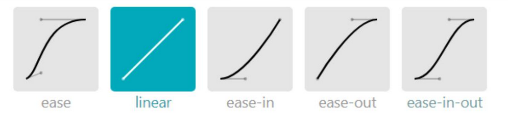

# 过渡与动画

### 过渡

transition过渡属性是cSS3浓墨重彩的特性，过渡可以为一个元素在不同样式之间变化自动添加“补间动画”。

* 兼容性

  过渡从IE10开始兼容，移动端兼容良好。

* 优点

  动画细腻，内存开销小。

#### 基本使用

* 使用

  transition属性有4个要素，分别表示需要过渡的属性、动画的总时长、变化速度曲线、延迟时间。

  如果需要所有属性都参与过渡，可以将第一个要素写成all。all会引发效率问题，一般将需要过渡的属性写出，每个属性需要有四个要素，以逗号隔开。
  
  ```css
transition : width 1s linear 0s ;
  ```
  
  > 所有数值类型的属性，都可以参与过渡，比如width 64height、left、top、border-radius
  >
  > 背景颜色和文字颜色都可以被过渡
  >
  > 所有变形（包括2D和3D)都能被过渡
  
* 注意事项

  * 如果没有设置时间或者时间没有写单位，那么没有过渡效果的。
  * 部分需要过渡的属性，如果不设置初始状态，会没有过渡效果

* 小属性

  | 属性                       | 意义           |
  | -------------------------- | -------------- |
  | transition-property        | 需要过渡的元素 |
  | transition-duration        | 动画时间       |
  | transition-timing-function | 动画变化曲线   |
  | transition-delay           | 延迟时间       |


#### 过渡的缓动效果

* 常用的缓动参数



* 自定义动画缓动参数

  缓动参数是一种cubic-bezier(贝塞尔曲线)

  贝塞尔曲线可以通过网站https://cubic-bezier.com/生成

### 动画

* 动画定义

  可以使用@keyframes来定义动画，keyframes表示“关键帧”，在项目上线前，要补上@-webkit-这样的私有前缀。定义动画时，最好设置初始状态，否则可能会导致动画没有效果。

  ```css
  @keyframes r{
      from{
          transform:rotate(0);
      }
      to{
          transform:rotate(360deg);
      }
  }
  ```

  > r表示动画名字
  >
  > from表示起始状态，to表示结束状态

* 动画调用

  定义动画之后，就可以使用animation属性调用动画。animation属性有5个要素与transition属性类似，分别表示动画名字、动画的总时长、缓动效果、延迟时间、动画执行次数。

  ```css
  animation：r 1s linear 0s 3;
  ```

  > 如果希望动画永远执行可以写infinite
  >
  > 如果想让动画的第2、4、......(偶数次)）自动逆向执行，那么要加上alternate参数即可
  >
  > 如果想让动画停止在最后结束状态，那么要加上forwards

* 多关键帧动画

  用百分数替代from和to可以实现多关键帧动画

