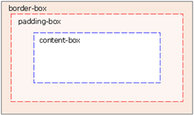

# 背景与渐变

background-color属性表示背景颜色

> 背景颜色可以用十六进制、rgb()、rgba()表示法表示
>
> padding区域有背景颜色

### 背景图片

background-image属性用来设置背景图片，图片路径要写到url()圆括号中，可以是相对路径，也可以是http://开头的绝对路径，可以设置多个背景图片。

> 如果样式表是外链的，那么要书写从CSS出发到图片的路径，而不是从html出发

#### 重复模式

background-repeat属性用来设置背景的重复模式

| 属性值    | 意义               |
| --------- | ------------------ |
| repeat    | x、y均平铺（默认） |
| repeat-x  | x平铺              |
| repeat-y  | y平铺              |
| no-repeat | 不平铺             |

#### 背景尺寸

background-size属性用来设置背景图片的尺寸，兼容到IE9。有以下两种方式进行属性值的设置：

1. 两个属性值

   属性值可以用百分数来设置，表示为盒子宽高的百分之几。

   等比例设置，则写auto。

2. 特殊值

   contain和cover是两个特殊的background-size的值

   * contain表示将背景图片智能改变尺寸以容纳到盒子里

     > 如果盒子尺寸比背景图片小，背景图片等比例缩小至能够全部放进盒子。

   * cover表示将背景图片智能改变尺寸以撑满盒子

#### 背景裁切

background-clip 属性用来设置元素的背景裁切到哪个盒子。兼容到IE9。

| 属性值      | 意义                                      |
| ----------- | ----------------------------------------- |
| border-box  | 背景延伸至边框（默认值）                  |
| padding-box | 背景延伸至内边（padding），不会绘制到边框 |
| content-box | 背景被裁减到内容区                        |

#### 背景起源

background-origin属性用来设置背景图像的位置区域。background-origin属性的本质是：定义background-position属性相对于什么位置来定位。

| 属性值      | 意义                       |
| ----------- | -------------------------- |
| border-box  | 从边框开始平铺             |
| padding-box | 从内边距开始平铺（默认值） |
| content-box | 从内容区开始平铺           |



#### 背景固定

background-attachment属性决定背景图像的位置是在视口内固定，或者随着包含它的区块滚动。

| 属性值 | 意义                                  |
| ------ | ------------------------------------- |
| fixed  | 自己滚动条不动，外部滚动条不动        |
| local  | 自己滚动条动，外部滚动条动            |
| scroll | 自己滚动条不动，外部滚动条动（默认值) |

#### 图片位置

background-position属性可以设置背景图片出现在盒子的什么位置。

可以用top、bottom、center、left、right描述图片出现的位置，如果只使用一个值，第二个值默认是center。

**css精灵**

将多个小图标合并制作到一张图片上，使用background-position属性单独显示其中一个，这样的技术叫做CSS精灵技术，也叫作CSS雪碧图。

CSS精灵可以减少HTTP请求数，加快网页显示速度，但不方便测量、后期改动麻烦。

> 精灵图属于背景图片中的一种。当给元素设置背景图时，如果背景图比较大，会默认显示背景图的左上角，如果想要显示背景图中的某部分，需要将背景图向上向左移动，这需要设置background-position属性为负值。

#### 综合属性

常用的背景属性可以合写到background属性中。

```css
selector{
    background:white url(images/prince.png) no-repeat center center;
}
```


### 渐变背景

* 线性渐变

  盒子的background-image属性可以用linear-gradient()形式创建线性渐变背景。

  至少需要使用三个属性值代表渐变方向、开始颜色、结束颜色。如果不写渐变方向，默认to bottom。

  渐变方向可以用度数(deg)表示。

  可以有多个颜色值，并且可以用百分数定义它们出现的位置。

  ```css
  selector{
      background-image:linear-gradient(to right,blue,red);
  }
  ```

径向渐变

盒子的background-image属性可以用radial-gradient()形式创建径向渐变背景。径向渐变第一个参数是用空格隔开的圆心坐标，

### 浏览器私有前缀

不同浏览器有不同的私有前缀，用来对试验性质的CSS属性加以标识

| 品牌     | 前缀     |
| -------- | -------- |
| Chrome   | -webkit- |
| Firefox  | -moz-    |
| IE、Edge | -ms-     |
| 欧朋     | -o-      |

