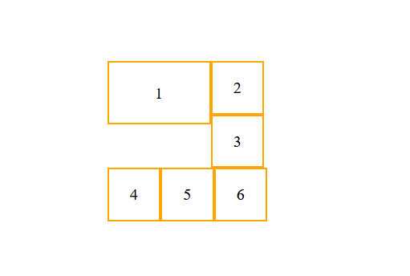
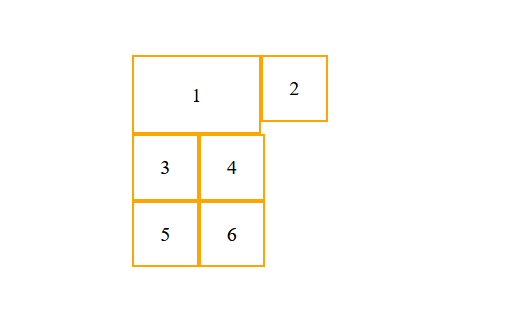

# 浮动

浮动使用float标签实现，属性值可以设置left、right。浮动的元素不再区分块级元素、行内元素，已经脱离了标准文档流，一律能够设置宽度和高度，即使它是span或者a标签等。

**浮动设计初衷**

浮动能将一个元素（通常是一张图片）拉到其容器的一侧，这样文档流就能够包围它。这种布局在报纸和杂志中很常见，因此CSS增加了浮动来实现这种文字环绕效果。

浮动元素会被移出正常文档流，被拉到容器边缘，文档流会重新排列，包围浮动元素。

## 容器折叠

如果父容器没有设置高度(内部元素需要动态显示)，而内部元素设置浮动，那么父容器的高度可能会塌陷，这种现象称为容器折叠。

> 其他会导致容器折叠的属性
>
> display：none；position：absolute/fixed/sticky

### 清除浮动

清除浮动，即清除浮动容器折叠的特性。

#### 清除浮动方法

1. 父盒子形成BFC

    让内部有浮动的父盒子形成BFC，它就能关闭住内部的浮动。此时最好的方法就是overflow:hidden属性

    不足：没有一个BFC声明能够在所有场合下都适用

2. 插入clear：both；

    clear表示清除浮动对自己的影响，both表示左右浮动都清除。该声明让父盒子拓展到浮动元素下面。

    * 给浮动元素的父盒子后的元素设置clear:both声明。该方法的副作用是元素的margin-top会失效，因为前一个父盒子高度没变。

    * 使用:after伪元素给盒子添加最后一个子元素，并且给::after设置clear:both。
    
        ```css
        .clearfix:after{
            content:'';
            clear:both;
            display:block;
    }
        ```
    
        不足：浮动元素的外边距不会折叠到清除浮动容器的外部，非浮动元素的外边距则会正常折叠。
    
    * 在两个父盒子之间“隔墙”，隔一个携带clear:both的盒子
    
        不足：裸露的div标签没有语义
        

#### 最佳实践

在清除浮动时使用display: table能够包含外边距，因为外边距无法通过单元格元素折叠。

```css
.clearfix:after{
content:"";
display:table;
clear:both;
}
.clearfix{*zoom:1;}
```

## 浮动排列

如果同一个父盒子的浮动元素高度不一致，当浮动元素换行排列时，会位于最靠上的地方，而不是预想的靠左的位置，如下图所示。要想修复这个问题，可以清除换行浮动元素上面的浮动。



下面为每行两个浮动元素的情况的解决方案。

```css
.ele:nth-child(odd){
    clear: left;
}
```

如果不知道每行要求的元素个数，那么最好使用别的布局方案。使用上述代码后的效果如下图。



### 使用浮动实现网页布局

注意事项：

1. 垂直显示的盒子，不要设置浮动，只有并排显示的盒子才要设置浮动
2. 大盒子中的小盒子可以继续使用浮动
3. 不要节约盒子

浮动布局的问题：

1. 容错性低
2. 需要元素固定尺寸，很难重用
3. 低版本IE会出现问题

### 流体布局

浮动初衷是为了文字环绕效果，可以利用它实现流体布局。

1. 文字环绕变体

   中间标题使用text-align:center;两侧信息可以使用左浮动和右浮动

2. 单侧固定

   前一个元素使用width+float，后跟随信息的元素使用padding-left/margin-left

3. 智能自适应尺寸

   前一个元素使用float，后跟随元素使用display:table-cell;(IE8+)、display:inline-block(IE7)

## BFC规范

BFC (Box Formatting Context，块级格式化上下文)是页面上的一个隔离的独立容器，容器里面的子元素不与外面的元素重叠或相互影响。

### BFC作用

* BFC可以取消盒子margin折叠
* BFC可以可以阻止元素被浮动元素覆盖
* 包含了内部所有的浮动元素

### 创建BFC方法

1. float值不为none

2. position值不是static或者relative

3. display值是inline-block、table、table-cell、table-caption、flex、inline-flex、grid、inline-grid

4. overflow值不为visible

   > overflow:hidden;表示溢出隐藏，溢出盒子边框的内容将会被隐藏
   > overflow:hidden;是非常好用的让盒子形成BFC的方法

#### 创建方法差异

* 使用浮动或者inline-block方式创建BFC的元素宽度会变成100%，因此需要限制一下元素的宽度，防止因为过宽而换行
* 使用table-cell方式显示的元素，其宽度只会刚好容纳其中的内容，因此需要设置一个较大的宽度，强制使其填满剩余空间

#### 浏览器差异

IE6、7浏览器使用haslayout机制，和BFC规范略有差异，比如IE浏览器可以使用zoom:1属性“让盒子拥有layout"
如果要制作兼容到lE6、7的网页时，尽量让网页布局变得简单，内部有浮动的盒子要设置height属性，规范编程，不要“玩杂技”