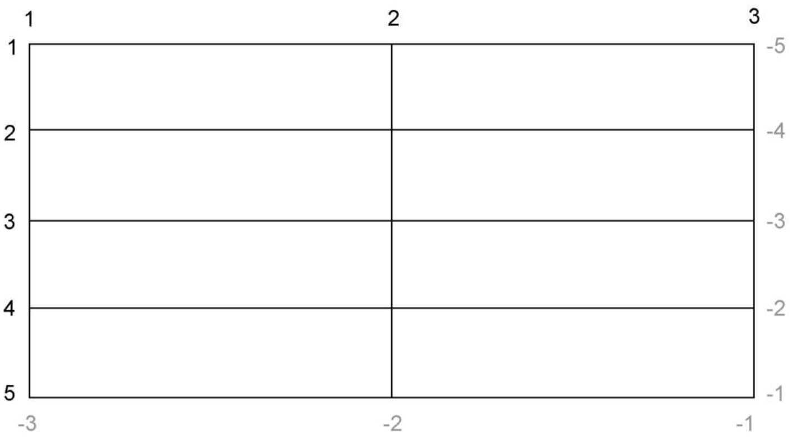

# 网格布局

网格布局(Grid Layout Module)，是一种布局新规范。CSS网格可以定义由行和列组成的二维布局，然后将元素放置到网格中。

## 原理

如果元素的display设置为grid或inline-grid，那么该元素称为一个网格容器，它的子元素成为网格元素。

### 组成要素

* 网格线

  网格线构成了网格的框架，grid-gap实际上是网格线的粗细程度。

* 网格轨道

  网格轨道是两条同方向相邻网格线之间的空间。有水平轨道、垂直轨道的区别。

* 网格单元

  网格单元是水平和垂直轨道重叠的部分，网格单元之间是网格线。

#### 网格线的编号

浏览器给网格里的每个网格线都赋予了编号，如下图。



## 网格容器的属性

### 网格轨道定义

网格容器需要通过grid-template-columns和grid-template-rows定义了网格轨道，这些属性可以使用网格的分数单位或长度单位。

grid-template-columns定义了垂直轨道的个数及轨道的宽度，如果轨道个数与宽度有固定的重复模式，可以使用repeat()函数，repeat函数可以与其余单位混用。

```css
.container {
	display: grid;
    grid-template-columns: 1fr 1fr 1fr;
    grid-template-rows: repeat(4, auto);
    grid-gap:1.5em;
}
```

上面代码中给网格容器定义了3个等宽的垂直轨道，4个长度auto的水平轨道。

> 如果轨道大小设置为auto，轨道会根据自身内容拓展。

### 对齐方式

网格容器提供了justify-items、justify-content用于控制网格元素水平方向上的位置，align-items、align-content用于控制网格元素垂直方向上的位置。

#### 网格轨道

justify-content、align-content用于控制网络轨道的对齐方式。下面表格中`/`分

| 属性值        | 说明                             |
| ------------- | -------------------------------- |
| start         | 网格容器的上/左                  |
| end           | 网格容器的下/右                  |
| center        | 网格容器中间                     |
| stretch       | 拉伸填满网格容器                 |
| space-between | 剩余空间平均分配在网格轨道间     |
| space-around  | 剩余空间均分，在两端加上一半间距 |
| space-evenly  | 剩余空间均分，在两端加上间距     |

#### 网格元素

justify-items、align-items控制网格元素的对齐方式。如果设置这两个属性，则网格元素大小会由内容决定。

## 网格元素属性

### 声明位置

网格元素默认占据一个网格单元，如果需要占据多个网格单元，需要通过grid-column和grid-row属性声明网格元素的位置。

这两个属性是简写属性，grid-column是grid-column-start和grid-column-end的简写；grid-row是grid-row-start和grid-row-end的简写。

属性值为以`/`间隔的两个数字，这两个数字代表网格线的编号。属性值还可以使用span关键字加一个数字，数字表示占据网格轨道的个数。

#### grid-column

grid-column声明了网格元素水平方向上的位置。如果声明`grid-column:1/3`代表网格元素宽度从1号网格线到3号网格线。

#### grid-row

grid-row声明了网格元素垂直方向上的位置。如果声明`grid-row:1/3`代表网格元素高度从1号网格线到3号网格线。

#### justify-self、align-self

这两个属性能够覆盖网格容器声明的网格元素对齐方式，用于调整单个网格元素的对齐方式。

## 替代语法

### 命名的网格线

在声明网格轨道时，可以在中括号内写上网格线的名称，还可以给同一个网格线提供多个名称，只需用空格隔开。

```css
.container {
    display: grid;
    grid-template-columns: [start] 2fr [center] 1fr [end];
    grid-template-rows: reapeat(4,[row] auto);
}
.top {
    grid-column: start/end;
    grid-row: row 1/span 2;
}
```

上面的代码中声明了一条命名的水平网格线，每条水平网格线被命名为row。

网格元素声明位置时，将数字替换为对应的网格线名字即可。`row 1/span 2`表示从第一个命名为row的水平网格线开始，跨越两个水平网格轨道。

### 命名的网格区域

命名网格区域能够将网格元素直接定位到该区域中，无需借助网格线。实现该方法需要网格容器使用grid-template-areas属性，网格元素使用grid-area属性。

```css
.container {
    display: grid;
    grid-template-areas: "title title"
        				"nav nav"
        				"main aside1"
        				"main adide2";
    grid-template-columns: 2fr 1fr;
    grid-template-rows: repeat(4,auto);
}
.title {
    grid-area: title;
}
```

> 每个命名的网格区域必须组成一个矩形。不能创造更复杂的形状，比如L或者U型。使用`.`作为名称时，会使该区域空出。