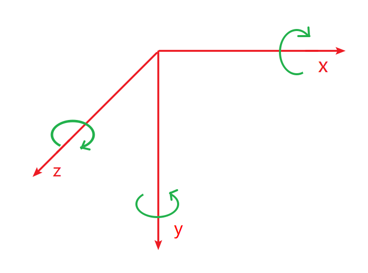

## 变形

transform属性的属性值包含平移、旋转、缩放等多个效果，对同一个元素设置多个transform属性时，后面的transtorm会覆盖前面的，而不会叠加，transform属性对行内元素不生效。

### 2D变形

* 旋转变形

  将transform属性的值设置为rotate()，即可实现旋转变形。若角度为正，则顺时针方向旋转，否则逆时针方向旋转

  ```css
  transform:rotate(45edg)
  ```

  可以使用transform-origin属性设置自己的自定义变换原点，默认绕中心旋转。

  

* 缩放变形

  将transform属性的值设置为scale()，即可实现缩放变形。当数值小于1时，表示缩小元素；大于1表示放大元素。

  transform: scale(sx,sy) 中，sx表示宽度缩放为原元素的sx倍，sy表示高度缩放为原元素的sy倍。

* 斜切变形

  将transform属性的值设置为skew()，即可实现斜切变形，需要书写两个值，表示x斜切角度，y斜切角度。当只有一个参数的时候，第二个参数默认为0deg

  ```css
  transform:skew(10deg,20deg);
  ```

* 位移变形

  将transform属性的值设置为translate()，即可实现位移变形。第一个参数表示水平方向移动，第二个参数表示垂直方向移动。使用translate移动时，元素实际移动的方向与旋转轴方向有关，所以平移与旋转的先后顺序会对最终结果产生影响。

  ```css
  transform:translate(100px,200px);
  ```

  和相对定位非常像，位移变形也会“老家留坑”，“形影分离”
  
  **与相对定位的区别**
  
  > translate与relative定位都是相对于元素自身位置移动，translate可以让元素在空间中移动，而relative不可以。
  
  1. relative更多的时候是用来给“设置了absolute定位的元素”做定位参照点
  2. translate更多的时候是用来做动画，比如元素有位置移动的动画，那么大多都用translate来完成。

### 3D变形

* 3D旋转

  将transform属性的值设置为rotatex()或者rotateY()，即可实现绕横轴、纵轴旋转。

  如下为各轴旋转方向

  

  **perspective属性**

  perspective属性用来定义透视强度，可以理解为“人眼到舞台的距离”，单位是px。

  父元素，又称舞台，需要设置perspective属性。当前元素，又称演员，设置transform属性。

* 空间移动

  当元素进行3D旋转后，即可继续添加translatex()、translateY()、translateZ()属性让元素在空间进行移动