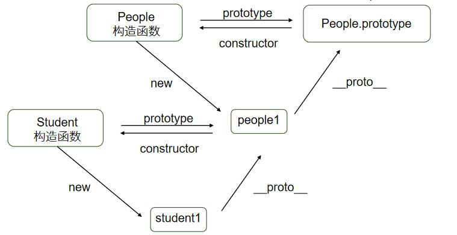

# 理解对象

JavaScript没有提供传统面向对象语言中的类式继承，而是通过原型委托的方式来实现对象与对象之间的继承。所有的JavaScript对象都是从Object.prototype对象上克隆而来的。

对象是属性与值的集合，属性是值的名称，如同变量是变量值的符号。方法是保存函数值的属性。

> 在js中，函数与方法并不作区分，函数值并不归属于对象，只是因为this的动态绑定，函数中的this有时会指向对象，对象的函数值属性与其他函数本质没有区别。

每个对象都有一个原型，原型是另一个作为属性后备源的对象。当访问一个对象没有的属性时，js引擎会到对象的原型里查找，如果依旧没有，查找原型的原型，直到遇到null。这样的一系列对象的链接称为原型链。原型链的顶端是Object.prototype，它是所有对象的祖先原型。

函数也是对象，函数对象的原型是Function. prototype。所有的函数默认都会拥有一个名为prototype的属性。

构造函数能够创建对象，该对象的原型可以通过构造函数的prototype属性指定。

> 构造函数只是使用了new操作符进行调用的函数。

每一个对象都有`[[prototype]]`内置属性，该属性指向这个对象的原型，但该属性无法被访问，Chrome和Firefox暴露`__proto__`属性，指向对象原型。

所以利用构造函数创建的对象的`__proto__`属性与构造函数的prototype属性指向相同，都是一个原型。

> ECMA-262把对象定义为：“无序属性的集合，其属性可以包含基本值、对象或者函数。”这就相当于说对象是一组没有特定顺序的键值对集合。对象的每个属性或方法都有一个名字，而每个名字都映射到一个值。

## 对象的使用

### 创建对象

#### 字面量

对象字面量是大括号包裹的键值对，键值对由k、v组成，k和v之间用冒号分隔，每组k :v之间用逗号分隔，最后一个k : v对后可以不书写逗号。

如果行首是大括号，内有键值对，这存在两个含义：对象字面量、包含标签的代码块。为了避免这种歧义，JavaScript 引擎的做法是，如果遇到这种情况，无法确定是对象还是代码块，一律解释为代码块。

如果要解释为对象，最好在大括号前加上圆括号。因为圆括号的里面，只能是表达式，所以确保大括号只能解释为对象。

#### 构造函数

JavaScript 语言使用构造函数（constructor）作为对象的模板。所谓”构造函数”，就是专门用来生成实例对象的函数。用new调用一个函数，这个函数就被称为“构造函数”，任何函数都可以是构造函数，只需要用new调用它。它是对象的模板，描述实例对象的基本结构。

构造函数的特点有两个。

- 函数体内部使用了`this`关键字，代表了所要生成的对象实例。
- 生成对象的时候，必须使用`new`命令。

#### Object.create()

对象可以使用Object.create()传入给定原型创建新对象。

### 运算符

#### in运算符

`in`运算符用于检查对象是否包含某个属性（注意，检查的是键名，不是键值），如果包含就返回`true`，否则返回`false`。

* 不能识别哪些属性是对象自身的，哪些属性是继承的

#### 扩展运算符

ES2018 将这个运算符[引入](https://github.com/sebmarkbage/ecmascript-rest-spread)了对象。

##### 解构赋值

对象的解构赋值中，扩展运算符用于从一个对象取值，相当于将目标对象自身的所有可遍历的（enumerable）、但尚未被读取的属性，分配到指定的对象上面。所有的键和它们的值，都会拷贝到新对象上面。

* 如果等号右边是`undefined`或`null`，就会报错，因为它们无法转为对象。
* 扩展运算符必须是最后一个参数，否则会报错。
* 扩展运算符的解构赋值，不能复制继承自原型对象的属性。

##### 扩展

对象的扩展运算符（`...`）用于取出参数对象的所有可遍历属性，拷贝到当前对象之中。

* 如果扩展运算符后面不是对象，则会自动将其转为对象。

```javascript
// 等同于 {...Object(true)}
{...true} // {}

// 等同于 {...Object(undefined)}
{...undefined} // {}

// 等同于 {...Object(null)}
{...null} // {}
```

* 如果扩展运算符后面是字符串，它会自动转成一个类似数组的对象
* 对象的扩展运算符，只会返回参数对象自身的、可枚举的属性
* 对象的扩展运算符后面可以跟表达式

### 属性操作

对象的所有键名都是字符串（ES6 又引入了 Symbol 值也可以作为键名），如果对象的键名不符合JS标识符命名规范，则这个键名必须用引号包裹。如果键名是数值，会被自动转为字符串。

对象的每一个键名又称为“属性”（property），它的“键值”可以是任何数据类型。如果一个属性的值为函数，通常把这个属性称为“方法”，它可以像函数那样调用。

#### 属性访问

读取对象的属性，有两种方法，一种是使用点运算符，还有一种是使用方括号运算符。

* 点语法

  如果属性名符合JS标识符规范，可以用`.attr`形式访问对象中指定键的值。

  数值键名不能使用点运算符（因为会被当成小数点）。

* 方括号语法

  如果属性名不符合JS标识符命名规范，则必须用`["attr"]`方括号形式写法来访问

  如果通过变量形式访问属性值，则必须使用`[aVar]`方括号形式

  方括号内可以放任何能够通过计算得到值的表达式。

  数字键可以不加引号，因为会自动转成字符串。

#### 属性赋值

点运算符和方括号运算符，不仅可以用来读取值，还可以用来赋值。

#### 属性的删除

如果要删除某个对象的属性，需要使用delete操作符。

* 删除一个不存在的属性，`delete`不报错，而且返回`true`。

* `delete`命令只能删除对象本身的属性，无法删除继承的属性。
* 该属性存在，且不得删除，`delete`命令会返回`false`。

#### 属性的简洁表示法

 ES6 允许在大括号里面，直接写入变量和函数，作为对象的属性和方法。属性名就是变量名, 属性值就是变量值。

  ```javascript
  const age = 23;
  const person = {
      age,
      getAge(){
          return this.age;
      }
                 };
  ```

简写的对象方法不能用作构造函数，会报错。

#### 属性名表达式

JavaScript 定义对象的属性，有两种方法。一是直接用标识符作为属性名，二是用表达式作为属性名，这时要将表达式放在方括号之内。ES5 中只能使用方法一；ES6 允许字面量定义对象时，用方法二（表达式）作为对象的属性名。

属性名表达式如果是一个对象，默认情况下会自动将对象转为字符串`[object Object]`。

#### 可枚举性和遍历

##### 可枚举性

对象的每个属性都有一个描述对象（Descriptor），用来控制该属性的行为。`Object.getOwnPropertyDescriptor`方法可以获取该属性的描述对象。

描述对象的`enumerable`属性，称为“可枚举性”，如果该属性为`false`，就表示某些操作会忽略当前属性。

有四个操作会忽略`enumerable`为`false`的属性。

- `for...in`循环：只遍历对象自身的和继承的可枚举的属性。
- `Object.keys()`：返回对象自身的所有可枚举的属性的键名。
- `JSON.stringify()`：只串行化对象自身的可枚举的属性。
- `Object.assign()`： 忽略`enumerable`为`false`的属性，只拷贝对象自身的可枚举的属性。

只有`for...in`会返回继承的属性，其他三个方法都会忽略继承的属性。

##### 遍历

ES6 一共有 5 种方法可以遍历对象的属性。

1. for ... in

   `for...in`循环遍历对象自身的和继承的可枚举属性（不含 Symbol 属性）。

2. Object.keys(obj)

   `Object.keys`返回一个数组，包括对象自身的（不含继承的）所有可枚举属性（不含 Symbol 属性）的键名。

3. Object.getOwnPropertyNames(obj)

   `Object.getOwnPropertyNames`返回一个数组，包含对象自身的所有属性（不含 Symbol 属性，但是包括不可枚举属性）的键名。

4. Object.getOwnPropertySymbols(obj)

   `Object.getOwnPropertySymbols`返回一个数组，包含对象自身的所有 Symbol 属性的键名。

5. Reflect.ownKeys(obj)

   `Reflect.ownKeys`返回一个数组，包含对象自身的（不含继承的）所有键名，不管键名是 Symbol 或字符串，也不管是否可枚举。

以上的 5 种方法遍历对象的键名，都遵守同样的属性遍历的次序规则。

- 首先遍历所有数值键，按照数值升序排列。
- 其次遍历所有字符串键，按照加入时间升序排列。
- 最后遍历所有 Symbol 键，按照加入时间升序排列。

### 关键字

#### new

`new`命令的作用，就是执行构造函数，返回一个实例对象。

`new`命令执行时，构造函数内部的`this`，就代表了新生成的实例对象。

* `new`命令本身就可以执行构造函数，所以后面的构造函数可以带括号，也可以不带括号。
* 如果构造函数内部有`return`语句，而且`return`后面跟着一个对象，`new`命令会返回`return`语句指定的对象

##### 原理

使用`new`命令时，它后面的函数依次执行下面的步骤。

1. 创建一个空对象，作为将要返回的对象实例。
2. 将这个空对象的原型，指向构造函数的`prototype`属性。
3. 将这个空对象赋值给函数内部的`this`关键字。
4. 开始执行构造函数内部的代码。

##### new.target

函数内部可以使用`new.target`属性。如果当前函数是`new`命令调用，`new.target`指向当前函数，否则为`undefined`。

#### super

ES6 新增了一个关键字`super`，指向当前对象的原型对象。

`super`关键字表示原型对象时，只能用在对象的方法之中，用在其他地方都会报错。

JavaScript 引擎内部，`super.foo`等同于`Object.getPrototypeOf(this).foo.call(this)`（方法）。

## this关键字

JavaScript中this表示函数上下文，总是指向一个对象，这个对象是在运行时基于函数的执行环境动态绑定的，并不是在编写时绑定，和函数声明的位置没有任何关系。

this的设计目的是在函数体内部，指代函数当前的运行环境。当函数没有被调用，则无法确定其上下文。

### 绑定规则

函数的调用方式决定了this的绑定对象。

#### 默认绑定

当函数作为普通函数进行调用时，此时this绑定规则如下：

* 在非严格模式下，函数的上下文是window全局对象(在浏览器环境下)
* 在严格模式下，函数上下文是undefined(es5)

#### 隐式绑定

当函数作为对象的方法进行调用时，this绑定了该对象，对象属性引用链中只有上一层或者说最后一层在调用位置中起作用。

#### 显式绑定

大多函数都存在call、apply、bind方法，它们第一个参数是一个对象，在调用函数时会将this绑定到该对象上。如果参数为空、`null`和`undefined`，则默认传入全局对象。

`apply`方法与`call`方法作用类似，改变`this`指向，然后再调用该函数。

`bind()`方法用于将函数体内的`this`绑定到某个对象，然后返回一个新函数。

##### call()

`call`的第一个参数就是`this`所要指向的那个对象，后面的参数则是函数调用时所需的参数。

##### apply()

`apply`方法的第一个参数也是`this`所要指向的那个对象，第二个参数则是一个数组，该数组的所有成员依次作为参数，传入原函数。

##### bind()

`bind`方法的第一个参数就是所要绑定`this`的对象，其余参数会绑定原函数的参数。

#### new绑定

当用new运算符调用函数时，该函数总会返回一个对象，通常情况下，构造器里的this就指向返回的这个对象

### 判定规则

判定规则中的函数不能是Lambda表达式。

1. 对象打点调用它的方法函数，则函数的上下文是这个打点的对象
2. 如果在浏览器中执行，圆括号直接调用函数，在非严格模式下，函数的上下文是window全局对象；在严格模式下，函数上下文是undefined
3. 数组（类数组对象)枚举出函数进行调用，上下文是这个数组（类数组对象)
4. IIFE中的函数，上下文是window对象
5. 定时器、延时器调用函数，上下文是window对象
6. 事件处理函数的上下文是绑定事件的DOM元素

如果内层函数需要使用外层函数的上下文，需要将上下文赋值给变量达到备份上下文的作用。

## 对象的继承

通过构造函数为实例对象定义属性，虽然很方便，但是有一个缺点。同一个构造函数的多个实例之间，无法共享属性，从而造成对系统资源的浪费。

继承有利于代码复用，JavaScript中继承分为es5的原型继承和es6的class继承。class继承本质上是原型继承。

JavaScript使用原型模式来搭建整个面向对象系统的。原型编程有如下规则：

* 所有的数据都是对象
* 要得到一个对象，不是通过实例化类，而是找到一个对象作为原型并克隆它
* 对象会记住它的原型
* 如果对象无法响应某个请求，它会把这个请求委托给它自己的原型。

### prototype

JavaScript 规定，每个函数都有一个`prototype`属性，指向一个对象，它默认拥有constructor属性指回函数。

对于构造函数来说，生成实例的时候，该属性会自动成为实例对象的原型，即构造函数的prototype属性是它的实例的原型。

实例对象的`__proto__`属性（前后各两个下划线），返回该对象的原型。该属性可读写。根据语言标准，`__proto__`属性只有浏览器才需要部署，其他环境可以没有这个属性。

当实例对象本身没有某个属性或方法的时候，它会到原型对象去寻找该属性或方法。如果实例对象自身就有某个属性或方法，它就不会再去原型对象寻找这个属性或方法。


### constructor

`prototype`对象有一个`constructor`属性，默认指向`prototype`对象所在的构造函数。

`constructor`属性的作用是，可以得知某个实例对象，到底是哪一个构造函数产生的。

有了`constructor`属性，就可以从一个实例对象新建另一个实例。

### 原型链

JavaScript 规定，所有对象都有自己的原型对象（prototype）。由于原型对象也是对象，所以它也有自己的原型。因此，就会形成一个“原型链”。

所有对象的原型最终都可以上溯到`Object.prototype`，`Object.prototype`的原型是`null`。`null`没有任何属性和方法，也没有自己的原型。因此，原型链的尽头就是`null`。

读取对象的某个属性时，JavaScript 引擎会顺着原型链进行查找，一旦找到即返回，如果对象自身和它的原型，都定义了一个同名属性，那么优先读取对象自身的属性，这叫做“覆盖”（overriding）。

#### instanceof 运算符

`instanceof`运算符返回一个布尔值，表示对象是否为某个构造函数的实例，用于判断值的类型。

`instanceof`运算符的左边是实例对象，右边是构造函数。它会检查右边构造函数的原型对象（prototype），是否在左边对象的原型链上。

由于`instanceof`检查整个原型链，因此同一个实例对象，可能会对多个构造函数都返回`true`。

由于任意对象（除了`null`）都是`Object`的实例，所以`instanceof`运算符可以判断一个值是否为非`null`的对象。有一种特殊情况，就是左边对象的原型链上，只有`null`对象。这时，`instanceof`判断会失真。

* `instanceof`运算符只能用于对象，不适用原始类型的值。
* 对于`undefined`和`null`，`instanceof`运算符总是返回`false`。

属性检查

* hasOwnProperty方法可以检查对象是否真正“自己拥有”某属性或者方法
* in运算符只能检查对象的某个属性或方法是否可以被访问。

### 构造函数的继承

1. 在子类的构造函数中，调用父类的构造函数。
2. 让子类的原型指向父类的原型，这样子类就可以继承父类原型。

```javascript
function Sub(value) {
  Super.call(this);
  this.prop = value;
}
Sub.prototype = Object.create(Super.prototype);
Sub.prototype.constructor = Sub;
```



## 属性描述对象

JavaScript 提供了一个内部数据结构，用来描述对象的属性，控制它的行为，比如该属性是否可写、可遍历等等。这个内部数据结构称为“属性描述对象”（attributes object）。

### 元属性

属性描述对象提供6个元属性。

1. `value`

`value`是该属性的属性值，默认为`undefined`。

2. `writable`

`writable`是一个布尔值，表示属性值（value）是否可改变（即是否可写），默认为`true`。

* 正常模式下，对`writable`为`false`的属性赋值不会报错，只会默默失败。但是，严格模式下会报错
* 如果原型对象的某个属性的`writable`为`false`，那么子对象将无法自定义这个属性。

3. `enumerable`

`enumerable`是一个布尔值，表示该属性是否可遍历，默认为`true`。如果设为`false`，会使得某些操作（比如`for...in`循环、`Object.keys()`）跳过该属性。

4. `configurable`

`configurable`是一个布尔值，表示属性的可配置性，默认为`true`。如果设为`false`，将阻止某些操作改写属性描述对象。也就是说，`configurable`属性控制了属性描述对象的可写性。

* `writable`属性只有在`false`改为`true`时会报错，`true`改为`false`是允许的。

* 只要`writable`和`configurable`有一个为`true`，就允许改动`value`。

  > 当configurable为true时，可以通过defineProperty()重新设置value值

* 可配置性决定了目标属性是否可以被删除

5. `get`

`get`是一个函数，表示该属性的取值函数（getter），默认为`undefined`。

6. `set`

`set`是一个函数，表示该属性的存值函数（setter），默认为`undefined`。

#### Object.getOwnPropertyDescriptor()

获取某个属性的描述对象。

第一个参数是目标对象，第二个参数是一个字符串，对应目标对象的某个属性名。

* 只能用于对象自身的属性，不能用于继承的属性。

#### Object.getOwnPropertyDescriptors()

ES5 的`Object.getOwnPropertyDescriptor()`方法会返回某个对象属性的描述对象（descriptor）。ES2017 引入了`Object.getOwnPropertyDescriptors()`方法，返回指定对象所有自身属性（非继承属性）的描述对象。

该方法的引入目的，主要是为了解决`Object.assign()`无法正确拷贝`get`属性和`set`属性的问题。

```javascript
function shallowClone(source) {
    return Object.create(Object.getPrototypeof(source), Object.getOwnPropertyDescriptors(source));
}
```

#### Object.defineProperty(), Object.defineProperties()

Object.defineProperty()通过描述对象，定义某个属性，返回修改后的对象。

`Object.defineProperty`方法接受三个参数，依次如下。

- object：属性所在的对象
- propertyName：字符串，表示属性名
- attributesObject：属性描述对

Object.defineProperties()通过描述对象，定义多个属性。

```javascript
var obj = Object.defineProperties({}, {
  p1: { value: 123, enumerable: true },
  p2: { value: 'abc', enumerable: true },
  p3: { get: function () { return this.p1 + this.p2 },
    enumerable:true,
    configurable:true
  }
});
```

* 一旦定义了取值函数`get`（或存值函数`set`），就不能将`writable`属性设为`true`，或者同时定义`value`属性，否则会报错

#### propertyIsEnumerable()

实例对象的`propertyIsEnumerable()`方法返回一个布尔值，用来判断某个属性是否可遍历。

* 这个方法只能用于判断对象自身的属性，对于继承的属性一律返回`false`。

### 控制对象状态

防止对象被改变。JavaScript 提供了三种冻结方法，最弱的一种是`Object.preventExtensions`，其次是`Object.seal`，最强的是`Object.freeze`。

局限性：

1. 可以通过改变原型对象，来为对象增加属性。
2. 如果属性值是对象，上面这些方法只能冻结属性指向的对象，而不能冻结对象本身的内容。

#### Object.preventExtensions()

使得一个对象无法再添加新的属性。

#### Object.isExtensible()

检查是否可以为一个对象添加属性。

#### Object.seal()

使得一个对象既无法添加新属性，也无法删除旧属性。

实质是把属性描述对象的`configurable`属性设为`false`。

#### Object.isSealed()

判断一个对象是否可配置。

#### Object.freeze()

`Object.freeze`方法可以使得一个对象无法添加新属性、无法删除旧属性、也无法改变属性的值，使得这个对象实际上变成了常量。

* 使用`Object.freeze`方法以后，`Object.isSealed`将会返回`true`，`Object.isExtensible`返回`false`。

#### Object.isFrozen()

判断一个对象是否被冻结。

## 对象方法

### 静态方法

#### 属性迭代

##### Object.getOwnPropertyNames()

`Object.getOwnPropertyNames`用来遍历对象的属性。

`Object.getOwnPropertyNames`方法参数是个对象，返回一个数组。该数组成员是该对象自身的、包含不可枚举、非Symbol属性名。

##### Object.keys(), Object.values(), Object.entries()

ES5 引入了`Object.keys`方法，ES2017 [引入](https://github.com/tc39/proposal-object-values-entries)了跟`Object.keys`配套的`Object.values`和`Object.entries`。这些方法都用来遍历对象的属性。

这些方法都接收一个对象参数，返回一个数组。如果参数不是对象，会将其转换为对象。

`Object.keys`方法返回的数组成员都是该对象自身的（而不是继承的）所有可枚举、非Symbol属性名。

`Object.values`方法返回的数组成员都是该对象自身的（而不是继承的）所有可枚举、非Symbol属性值。

`Object.entries`方法返回的数组成员都是该对象自身的（而不是继承的）所有可枚举、非Symbol属性键值对数组。

##### Object.fromEntries()

`Object.fromEntries()`方法是`Object.entries()`的逆操作，用于将一个键值对数组转为对象。

用途

1. 将键值对的数据结构还原为对象，因此特别适合将 Map 结构转为对象。
2. 配合`URLSearchParams`对象，将查询字符串转为对象。

#### 原型链

##### `__proto__`属性

`__proto__`属性（前后各两个下划线），用来读取或设置当前对象的原型对象（prototype）。

由于浏览器广泛支持，才被加入了 ES6。标准明确规定，只有浏览器必须部署这个属性，其他运行环境不一定需要部署，而且新的代码最好认为这个属性是不存在的。

尽量使用下面的`Object.setPrototypeOf()`（写操作）、`Object.getPrototypeOf()`（读操作）、`Object.create()`（生成操作）代替。

##### Object.create()

该方法接受一个对象作为参数，然后以它为原型，返回一个实例对象。该实例完全继承原型对象的属性。

`Object.create()`方法还可以接受第二个参数。该参数是一个属性描述对象，它所描述的对象属性，会添加到实例对象，作为该对象自身的属性。

* 参数不能为空，或者不是对象，否则会报错。
* 生成的对象，继承了它的原型对象的构造函数。

##### Object.getPrototypeOf()

获取对象的`Prototype`对象。

##### Object.setPrototypeOf()

`Object.setPrototypeOf`方法的作用与`__proto__`相同，用来设置一个对象的原型对象，返回参数对象本身。它是 ES6 正式推荐的设置原型对象的方法。

* 如果第一个参数不是对象，会自动转为对象。但是由于返回的还是第一个参数，所以这个操作不会产生任何效果。
* 如果第一个参数是`undefined`或`null`会报错。

#### Object.is()

ES5 比较两个值是否相等，只有两个运算符：相等运算符（`==`）和严格相等运算符（`===`）。它们都有缺点，前者会自动转换数据类型，后者的`NaN`不等于自身，以及`+0`等于`-0`。

ES6 提出“Same-value equality”（同值相等）算法，用来解决这个问题。`Object.is`就是部署这个算法的新方法。它用来比较两个值是否严格相等，与严格比较运算符（===）的行为基本一致。

不同之处只有两个：一是`+0`不等于`-0`，二是`NaN`等于自身。

#### Object.assign()

`Object.assign()`方法用于对象的合并，将源对象（source）的所有可枚举属性，复制到目标对象（target）。

第一个参数是目标对象，后面的参数都是源对象。

* `Object.assign()`方法实行的是浅拷贝，而不是深拷贝。

* 如果目标对象与源对象有同名属性，或多个源对象有同名属性，则后面的属性会覆盖前面的属性。
* 如果只有一个参数，`Object.assign()`会直接返回该参数。如果该参数不是对象，则会先转成对象，然后返回。
* 由于`undefined`和`null`无法转成对象，所以如果它们作为首参数，就会报错。
* source参数如果是不可枚举的数据类型会忽略合并
* Object.assign()拷贝源对象自身属性，不拷贝不可枚举属性，拷贝Symbol属性
* 因为是用**等号**进行赋值,如果被赋值的对象的属性有setter函数会触发setter函数,同理如果有getter函数,也会调用赋值对象的属性的getter函数

#### Object.hasOwn()

ES5提供了对象实例方法`hasOwnProperty()`，可以判断某个属性是否为原生属性。ES2022 在`Object`对象上面新增了一个静态方法[`Object.hasOwn()`](https://github.com/tc39/proposal-accessible-object-hasownproperty)，也可以判断是否为自身的属性。

第一个参数是所要判断的对象，第二个是属性名。

该方法对于不继承`Object.prototype`的对象不会报错，而`hasOwnProperty()`是会报错的。

### 实例方法

| 方法             | 说明                                                         |
| ---------------- | ------------------------------------------------------------ |
| valueOf()        | 返回当前对象对应值，用于自动类型转换                         |
| toString()       | 返回一个对象字符串形式，使用call用于判断类型                 |
| toLocaleString() | 返回一个值的字符串形式，用来返回针对某些地域的特定的值。     |
| hasOwnProperty() | 接受一个字符串作为参数，返回一个布尔值，表示该实例对象自身是否具有该属性。 |

#### toString()

`Object.prototype.toString`方法返回对象的类型字符串，因此可以用来判断一个值的类型。通过函数的`call`方法，可以在任意值上调用这个方法.

不同数据类型的`Object.prototype.toString`方法返回值如下。

- 数值：返回`[object Number]`。
- 字符串：返回`[object String]`。
- 布尔值：返回`[object Boolean]`。
- undefined：返回`[object Undefined]`。
- null：返回`[object Null]`。
- 数组：返回`[object Array]`。
- arguments 对象：返回`[object Arguments]`。
- 函数：返回`[object Function]`。
- Error 对象：返回`[object Error]`。
- Date 对象：返回`[object Date]`。
- RegExp 对象：返回`[object RegExp]`。
- 其他对象：返回`[object Object]`。

#### isPrototypeof()

实例对象的`isPrototypeOf`方法，用来判断该对象是否为参数对象的原型。

只要实例对象处在参数对象的原型链上，`isPrototypeOf`方法都返回`true`。

#### 方法重载

如果两个方法的名称相同，但形参个数不同，那么称这种现象为方法重载。

JavaScript中没有支持方法重载的语法机制，然而我们通过应用闭包和arguments可以实现方法重载的功能，实现代码如下。

```javascript
function addMethod(obj,name,func) {
    let oldFunc = obj[name];
    obj[name] = function(){
        if(func.length===arguments.length){
            func.apply(this,arguments);
        }else if(typeof oldFunc ==="function"){
            oldFunc.apply(this,arguments);
        }
    }
}
```

> addMethod函数传入的三个参数分别为需要实现方法重载功能的对象、方法名、匿名函数。注意，该匿名函数必须是通过function定义。
>
> 函数体内使用oldFunc保存之前的同名方法。在方法调用时，如果形参个数与实参个数不匹配，则会通过oldFunc逐次调用之前的方法。

如果想要在类中实现方法重载，需要在类的原型上添加方法。
