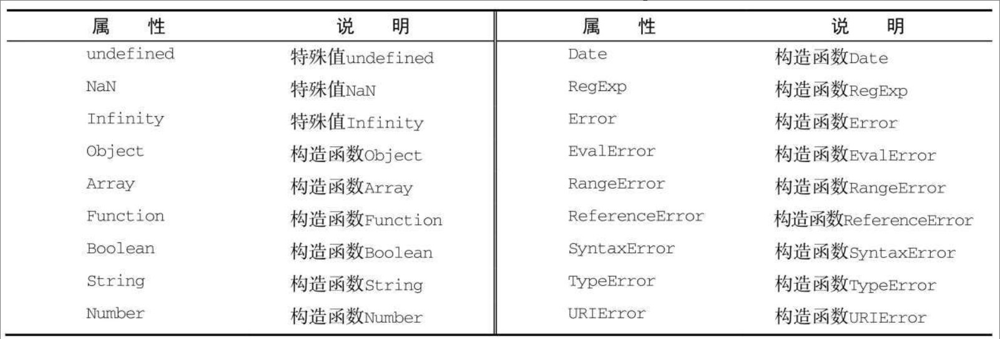

# 内置对象

内置对象是由ECMAScript实现提供的、不依赖于宿主环境的对象，这些对象在ECMAScript程序执行之前就已经存在了。Object、Array、String等都是内置对象，除此之外还有两个单体内置对象：Global和Math。

## Global对象

不属于任何其他对象的属性和方法，最终都是它的属性和方法。事实上，没有全局变量或全局函数；所有在全局作用域中定义的属性和函数，都是Global对象的属性。诸如isNaN()、isFinite()、parseInt()以及parseFloat()。

### 方法

#### URI编码方法

Global对象的encodeURI()和encodeURIComponent()方法可以对URI（Uniform Resource Identifiers，通用资源标识符）进行编码。decodeURI()和decodeURIComponent()可以对编码过的URI进行解码。

encodeURI()主要用于整个URI（例如，http://www.wrox.com/illegal_value.htm），而encodeURIComponent()主要用于对URI中的某一段（例如前面URI中的illegal value.htm）进行编码。它们的主要区别在于，encodeURI()不会对本身属于URI的特殊字符进行编码，例如冒号、正斜杠、问号和井字号；而encodeURIComponent()则会对它发现的任何非标准字符进行编码。

decodeURI()仅能够解码使用encodeURI()编码后的字符，decodeURIComponent()可以解码任何特殊字符的编码。

#### eval()方法

eval()方法接收JavaScript代码字符串，并执行。

当解析器发现代码中调用eval()方法时，它会将传入的参数当作实际的ECMAScript语句来解析，然后把执行结果插入到原位置。

在eval()中创建的任何变量或函数都不会被提升，因为在解析代码的时候，它们被包含在一个字符串中；它们只在eval()执行的时候创建。

严格模式下，在外部访问不到eval()中创建的任何变量或函数。

### 属性

JavaScript中使用的全局变量都是Global对象的属性。如undefined、NaN、infinity等特殊值，Object、Function等构造函数。

下面的表格包含了Global对象所有属性。



### window对象

前端js中，浏览器将Global对象作为window对象的一部分加以实现。在全局作用域上声明的变量和方法都是window对象的属性。

## Math对象

ECMAScript还为保存数学公式和信息提供了一个公共位置，即Math对象。

### 属性

| 属性    | 说明            |
| ------- | --------------- |
| E       | 自然对数的底数  |
| LN10    | 10的自然对数    |
| LN2     | 2的自然对数     |
| LOG2E   | 以2位底e的对数  |
| LOG10E  | 以10为底e的对数 |
| SQRT1_2 | 1/2的平方根     |
| SQRT2   | 2的平方根       |

### 方法

#### 常用方法

| 方法     | 说明                   |
| -------- | ---------------------- |
| min()    | 确定一组数值中的最小值 |
| max()    | 确定一组数值中最大值   |
| ceil()   | 向上舍入               |
| floor()  | 向下舍入               |
| round()  | 四舍五入               |
| random() | 返回[0,1)的随机数      |

除了上面的方法，Math对象还存在着一些数学计算方法。

Math.min()如果没有传参数，返回Infinity；Math.max()如果没有传参数，返回-infinity。

#### 拓展方法

ES6 在 Math 对象上新增了 17 个与数学相关的方法。这些方法对于非数值，内部使用`Number`方法将其先转为数值，对于空值和无法截取整数的值，返回`NaN`。

| 方法          | 说明                                                         |
| ------------- | ------------------------------------------------------------ |
| Math.trunc()  | 用于去除一个数的小数部分，返回整数部分。                     |
| Math.sign()   | 用来判断一个数到底是正数、负数、还是零。                     |
| Math.cbrt()   | 用于计算一个数的立方根。                                     |
| Math.clz32()  | 将参数转为 32 位无符号整数的形式，然后返回这个 32 位值里面有多少个前导 0。 |
| Math.imul()   | 返回两个数以 32 位带符号整数形式相乘的结果                   |
| Math.fround() | 返回一个数的32位单精度浮点数形式                             |
| Math.hypot()  | 返回所有参数的平方和的平方根                                 |
| Math.expm1()  | 返回e^x^ - 1                                                 |
| Math.log1p()  | 返回1 + x的自然对数                                          |
| Math.log10()  | 返回以10为底的x的对数                                        |
| Math.log2()   | 返回以2为底的x的对数                                         |
| Math.sinh()   | 返回x的双曲正弦                                              |
| Math.cosh()   | 返回x的双曲余弦                                              |
| Math.tanh()   | 返回x的双曲正切                                              |
| Math.asinh()  | 返回x的反双曲正弦                                            |
| Math.acosh()  | 返回x的反双曲余弦                                            |
| Math.atnh()   | 返回x的反双曲正切                                            |

##### Math.sign()

`Math.sign`方法用来判断一个数到底是正数、负数、还是零。对于非数值，会先将其转换为数值。

- 参数为正数，返回`+1`；
- 参数为负数，返回`-1`；
- 参数为 0，返回`0`；
- 参数为-0，返回`-0`;
- 其他值，返回`NaN`。
- 如果参数是非数值，会自动转为数值。对于那些无法转为数值的值，会返回`NaN`。

##### Math.clz32()

`Math.clz32()`方法将参数转为 32 位无符号整数的形式，然后返回这个 32 位值里面有多少个前导 0。

* 对于小数，`Math.clz32`方法只考虑整数部分。

## JSON对象

### JSON格式

JSON 格式（JavaScript Object Notation 的缩写）是一种用于数据交换的文本格式。

每个 JSON 对象就是一个值，可能是一个数组或对象，也可能是一个原始类型的值。

JSON 对值的类型和格式有严格的规定。

> 1. 复合类型的值只能是数组或对象，不能是函数、正则表达式对象、日期对象。
> 2. 原始类型的值只有四种：字符串、数值（必须以十进制表示）、布尔值和`null`（不能使用`NaN`, `Infinity`, `-Infinity`和`undefined`）。
> 3. 字符串必须使用双引号表示，不能使用单引号。
> 4. 对象的键名必须放在双引号里面。
> 5. 数组或对象最后一个成员的后面，不能加逗号。

### JSON.stringfy()

`JSON.stringify()`方法用于将一个值转为 JSON 字符串。该字符串符合 JSON 格式，并且可以被`JSON.parse()`方法还原。

* 对于原始类型的字符串，转换结果会带双引号。
* 如果对象的属性是`undefined`、函数或 XML 对象，该属性会被`JSON.stringify()`过滤。
* 如果数组的成员是`undefined`、函数或 XML 对象，则这些值被转成`null`。
* 正则对象会被转成空对象。

#### 第二个参数

`JSON.stringify()`方法还可以接受一个数组，作为第二个参数，指定参数对象的哪些属性需要转成字符串。只对对象的属性有效，对数组无效。

第二个参数还可以是一个函数，用来更改`JSON.stringify()`的返回值。如果处理函数返回`undefined`或没有返回值，则该属性会被忽略。

`JSON.stringify()`还可以接受第三个参数，用于增加返回的 JSON 字符串的可读性。

#### 第三个参数

默认返回的是单行字符串，对于大型的 JSON 对象，可读性非常差。

第三个参数使得每个属性单独占据一行，并且将每个属性前面添加指定的前缀（不超过10个字符）。如果是一个数字，则表示每个属性前面添加的空格（最多不超过10个）。

#### toJSON()

如果参数对象有自定义的`toJSON()`方法，那么`JSON.stringify()`会使用这个方法的返回值作为参数，而忽略原对象的其他属性。

### JSON.parse()

`JSON.parse()`方法用于将 JSON 字符串转换成对应的值。

如果传入的字符串不是有效的 JSON 格式，`JSON.parse()`方法将报错。

`JSON.parse()`方法可以接受一个处理函数，作为第二个参数，用法与`JSON.stringify()`方法类似。

## Date对象

### Date()

#### 普通函数

`Date`可以作为普通函数直接调用，返回一个代表当前时间的字符串。

#### 构造函数

构造函数传入的参数如果不符合下述情况将返回Invalid Date。

1. new Date()

   使用new Date()即可得到当前时间的日期对象，它是object类型值

2. new Date(milliseconds)

   创建一个Date对象，时间等于1970.1.1UTC+0经过的毫秒数

3. new Date(datestring)

   与Date.parse所使用的算法相同

4. new Date(year,month,date,hours,minutes,secondes,ms)

   - 年：使用四位数年份，比如`2000`。如果写成两位数或个位数，则加上`1900`，即`10`代表1910年。如果是负数，表示公元前。
   - 月：`0`表示一月，依次类推，`11`表示12月。
   - 日：`1`到`31`。
   - 小时：`0`到`23`。
   - 分钟：`0`到`59`。
   - 秒：`0`到`59`
   - 毫秒：`0`到`999`。

   这些参数如果超出了正常范围，会被自动折算。

   日期设为`0`，就代表上个月的最后一天。参数还可以使用负数，表示扣去的时间。

### Date实例

`Date`实例有一个独特的地方。其他对象求值的时候，都是默认调用`.valueOf()`方法，但是`Date`实例求值的时候，默认调用的是`toString()`方法。

#### 运算

类型自动转换时，`Date`实例如果转为数值，则等于对应的毫秒数；如果转为字符串，则等于对应的日期字符串。所以，两个日期实例对象进行减法运算时，返回的是它们间隔的毫秒数；进行加法运算时，返回的是两个字符串连接而成的新字符串。

### 静态方法

Date精度仅支持到毫秒，更高精度的数值需要通过其他方法获取，如浏览器提供performance.now()方法获取页面加载开始以毫秒为单位的微秒数。

#### Date.now()

`Date.now`方法返回当前时间距离时间零点（1970年1月1日 00:00:00 UTC）的毫秒数。

#### Date.parse()

`Date.parse`方法用来解析日期字符串，返回该时间距离时间零点（1970年1月1日 00:00:00）的毫秒数。如果解析失败，返回`NaN`。

字符串的格式为：`YYYY-MM-DDTHH:mm:ss.sssZ`

- `YYYY-MM-DD` —— 日期：年-月-日。
- 字符 `"T"` 是一个分隔符。
- `HH:mm:ss.sss` —— 时间：小时，分钟，秒，毫秒。
- 可选字符 `'Z'` 为 `+-hh:mm` 格式的时区。单个字符 `Z` 代表 UTC+0 时区。

#### Date.UTC()

`Date.UTC`方法接受年、月、日等变量作为参数，返回该时间距离时间零点（1970年1月1日 00:00:00 UTC）的毫秒数。

### 实例方法

`Date`的实例对象，有几十个自己的方法，除了`valueOf`和`toString`，可以分为以下三类。

- `to`类：从`Date`对象返回一个字符串，表示指定的时间。
- `get`类：获取`Date`对象的日期和时间。
- `set`类：设置`Date`对象的日期和时间。

#### to类

| 方法                 | 说明                                     |
| -------------------- | ---------------------------------------- |
| toString()           | 返回一个完整的日期字符串                 |
| toUTCString()        | 返回对应的 UTC 时间，比北京时间晚8个小时 |
| toISOString()        | 返回对应时间的 ISO8601 写法              |
| toJSON()             | 与`toISOString`方法的返回结果完全相同    |
| toDateString()       | 返回日期字符串（不含小时、分和秒）       |
| toTimeString()       | 返回时间字符串（不含年月日）             |
| toLocaleString()     | 完整的本地时间                           |
| toLocaleDateString() | 本地日期（不含小时、分和秒）             |
| toLocaleTimeString() | 本地时间（不含年月日）                   |

##### 本地时间

可以将 Date 实例转为表示本地时间的字符串。

- `Date.prototype.toLocaleString()`：完整的本地时间。
- `Date.prototype.toLocaleDateString()`：本地日期（不含小时、分和秒）。
- `Date.prototype.toLocaleTimeString()`：本地时间（不含年月日）。

这三个方法都有两个可选的参数。

```
dateObj.toLocaleString([locales[, options]])
dateObj.toLocaleDateString([locales[, options]])
dateObj.toLocaleTimeString([locales[, options]])
```

这两个参数中，`locales`是一个指定所用语言的字符串，`options`是一个配置对象。

#### get类

| 方法          | 说明                                 |
| ------------- | ------------------------------------ |
| getDate()     | 得到日期1~31                         |
| getDay()      | 得到星期0~6                          |
| getMonth()    | 得到月份0~11                         |
| getFullYear() | 得到年份                             |
| getHours()    | 得到小时数0~23                       |
| getMinutes()  | 得到分钟数0~59                       |
| getSeconds () | 得到秒数0~59                         |
| getTime()     | 返回距离1970年1月1日00:00:00的毫秒数 |

上面这些`get*`方法返回的都是当前时区的时间，`Date`对象还提供了这些方法对应的 UTC 版本，用来返回 UTC 时间。

- `getUTCDate()`
- `getUTCFullYear()`
- `getUTCMonth()`
- `getUTCDay()`
- `getUTCHours()`
- `getUTCMinutes()`
- `getUTCSeconds()`
- `getUTCMilliseconds()`

#### set类

`Date`对象提供了一系列`set*`方法，用来设置实例对象的各个方面。基本是跟`get*`方法一一对应的，但是没有`setDay`方法。超过范围的参数会自动进行校准。

- `setDate(date)`：设置实例对象对应的每个月的几号（1-31），返回改变后毫秒时间戳。
- `setFullYear(year [, month, date])`：设置四位年份。
- `setHours(hour [, min, sec, ms])`：设置小时（0-23）。
- `setMilliseconds(ms)`：设置毫秒（0-999）。
- `setMinutes(min [, sec, ms])`：设置分钟（0-59）。
- `setMonth(month [, date])`：设置月份（0-11）。
- `setSeconds(sec [, ms])`：设置秒（0-59）。
- `setTime(milliseconds)`：设置毫秒时间戳。

`set*`系列方法除了`setTime()`，都有对应的 UTC 版本，即设置 UTC 时区的时间。


