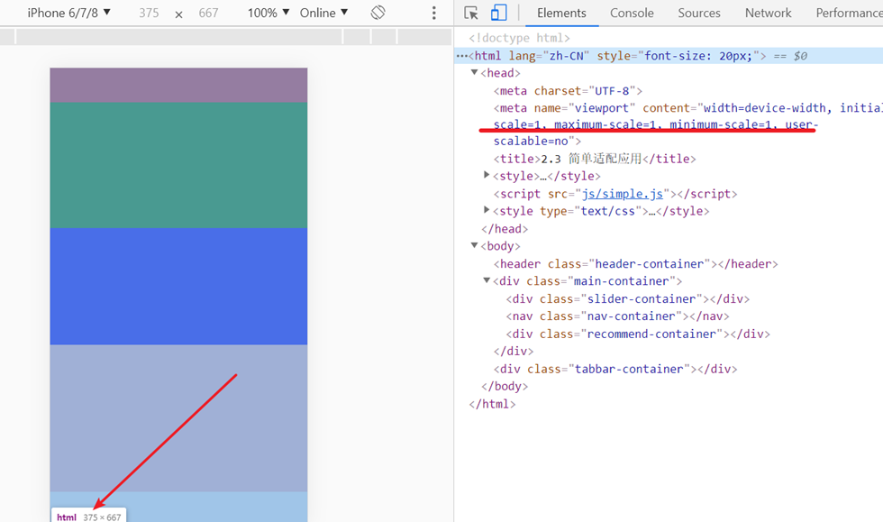

# 基础概念

## 像素

像素是图像最小单位的方格。

* 物理像素

  物理像素(physical pixel)，又称为设备像素(dp)，是设备屏幕上像素点的个数。

* CSS像素

  CSS像素，逻辑像素(logical pixel)，设备独立像素(dip)描述的是同一个东西。CSS像素是物理像素的抽象，设备屏幕原始的CSS像素大小与屏幕大小相关。

* 设备像素比(dpr)

  dpr=dp/dip（同一方向轴上）。dpr=2表示1个CSS像素可以用2*2个物理像素绘制。

  如果一个设备屏幕的dpr<=1，那么称该屏幕为标清屏；否则，为高清屏。

  可以通过`window.devicePixelRatio`获取到dpr。

* 缩放-放大

  缩放和放大的本质的是一个CSS像素对应于物理像素个数的变化。

* PPI

  PPI，pixels per inch，表示每英寸的物理像素点，又可以称为dpi，dots per inch。



上图中iPhone6的手机逻辑像素为375px*667px，dpr为2，则iPhone6的逻辑像素为750px\*1334px，如果dpr为1，则iPhone6的逻辑像素为375px\*667px。

页面缩放比initial-scale=手机逻辑像素/页面css像素，图中initial-scale=1，则页面宽度css像素为375px，如果initial-scale=0.5，则页面宽度css像素为750px。

## 视口

视口是设备屏幕上当前可见文档以css像素为单位的图形区域。如果视口宽度大于手机屏幕宽度的逻辑像素，那么浏览器会进行缩放使手机屏幕能容纳视口。

* 视口的设置

* 可以在head标签内使用meta标签规定视口的大小

  ```html
  <meta name="viewport" content="width=device-width,initial-scale=1,user-scalable=no,maximum-scale=1,minimum-scale=1">
  ```

  > initial-scale控制初始缩放比
  >
  > user-scalable控制用户能否缩放
  >
  > maximum-scale,minimum-scale控制最大最小缩放比

* 视口宽度获取

  1. window.innerWidth
  2. document.documentElement.clientWidth
  3. document.documentElement.getBoundingClientRect().width

**确定页面视口大小代码**

```javascript
function getPageWidthAndHeight(){
    var width = window.innerWidth,
        height = window.innerHeight;
   
    if(typeof pageWidth !="number"){
        if(document.compatMode=="CSS1Compat"){
            width = document.documentElement.clientWidth;
            height = document.documentElement.clientHeight;
        }else{
            width = document.body.clientWidth;
            height = document.body.clientHeight;
        }
    }
    return {
        width:width,
        height:height
    }
}
```


