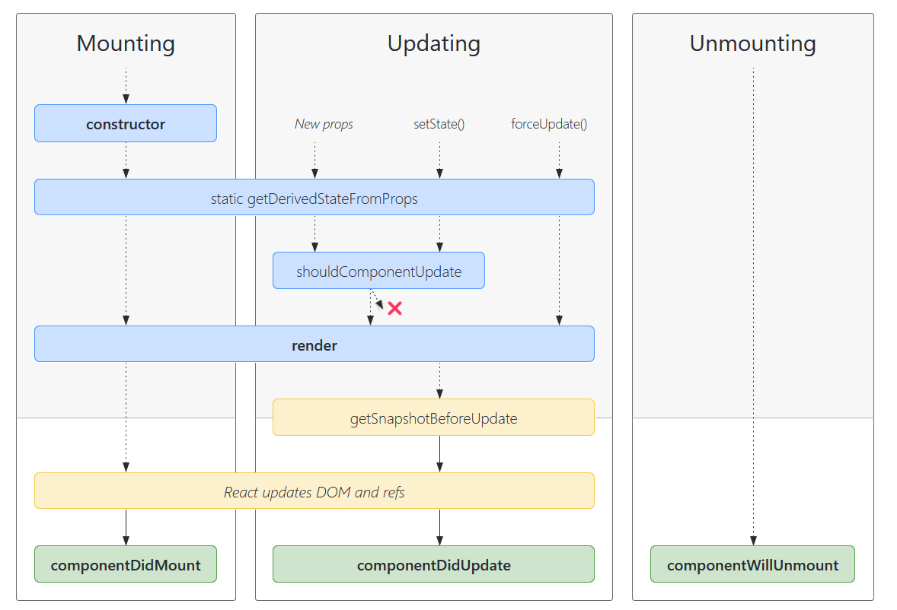

# 基本使用

## JSX语法

JSX是JavaScript的语法拓展，通过在js中的标签表示html元素，将该标签称为元素表达式。

### jsx语法规则

1.定义虚拟DOM时，不要写引号。

2.标签中混入js表达式时要用花括号。

3.样式的类名指定不要用class，要用className.

4.内联样式，要用style={{key : value}}的形式去写。

5.只有一个根标签，React提供了Fragment标签，该标签具有占位符的作用

6.标签必须闭合

7.标签首字母
	(1).若小写字母开头，则将改标签转为htm1中同名元素，若html中无该标签对应的同名元素，则报错。

​	(2).若大写字母开头，react就去渲染对应的组件，若组件没有定义，则报错。

8.如果需要插入原生html，dangerouslySetInnerHTML属性赋值为一个对象，该对象的__html属性为待插入值

### 条件判断

JSX是一个表达式，可以作为函数参数或返回值。因此实现条件判断有如下方式：

* 使用返回JSX的函数
* 使用三元表达式
* &&

### 列表渲染

列表渲染使用map将数据构造成JSX返回，对于每一项数据要使用key进行标识。key能够提高React使用diff算法的更新效率。

### 事件

通过onXxx方式指定事件处理函数，因为React采用自定义事件的方式实现更好的兼容性。

事件函数执行时，this指向undifined，需要使用bind修改指向。如果bind在花括号内，那么每次事件触发都会重新生成处理函数，降低性能，当处理函数不需要参数时，可以在构造函数内使用bind。

React事件采用事件委托方式处理，事件对象是React封装的SyntheticEvent类型，拥有DOM事件所有功能，可以通过nativeEvent获取原生事件对象。React中所有事件都被挂载到document上。

事件处理函数参数列表最后一个用于接收event。React事件处理函数不能通过返回false方式阻止默认行为，必须显式调用preventDefault。通过event访问target可以获取到发生事件的DOM元素对象。

## 组件实例核心属性

### state

#### setState

通过调用setState才能将数据变更反映到页面上，setState修改state时采用合并的方式。

* 不可变值

  state属性值要保证不可变，使用setState时保证使用一个临时值，否则会影响性能

* 可能是异步更新

  * 在方法中调用setState，更新时是异步，可以向setState传入回调函数作为第二个参数，获取最新值
  * 在setTimeout中调用setState，更新是同步的
  * 自定义的DOM事件，事件函数中setState是同步的

* 多次更新可能会合并

  * 异步更新时，传入对象，多次更新会被合并，传入函数，不会被合并

#### this指向问题

如果将类普通方法直接绑定到事件上，方法执行时，this指向undifined，解决该问题：使用bind修改指向或者使用静态方法。

```javascript
class Demo extends React.Component{
    constructor(props){
        super(props)
        this.clickHandler1 = this.clickHandler1.bind(this)
    }
    render(){
        return <div onClick={this.clickHandler}>Click</div>
    }
    clickHandler=()=>{// 该方法存在于Demo实例上，不在其原型上
        console.log(this)
    }
    clickHandler1(){
        console.log(this)
    }
}
```

### props

注意点：

* 构造器是否接收props，是否传递给super，取决于构造器中是否通过this访问props属性

#### 传递数据

```javascript
const person1 = <Person name = 'Bob' age = 12/>;
const data = { name: 'Alice', age = 14};
const person2 = <Person {...data} />
```

#### 类型检查

React提供了一种机制可以限定props，限制props传入属性的类型，是否必传。

如果限制属性为函数，使用PropTypes.func。

> 安装prop-types包，组件的propTypes属性赋值为一个对象，通过如下方式限定
>
> ```javascript
> List.propTypes = {list:PropTypes.arrayOf(PropTypes.object).isRequired}
> List.defaultProps = {
>     list: []
> }
> ```

### ref

ref有三种使用方式。

#### 字符串Ref

该方式存在一些效率问题，不推荐使用。

```javascript
//赋值
<input ref="input" type="text"/>
// 取值
const { input } = this.refs;
console.log(input.value);
```

#### 回调Ref

如果组件ref属性是函数，React调用时会传入当前节点作为参数。

```javascript
<input ref={inputNode=>{ this.inputNode = inputNode;}} type="text"/>
```

如果ref回调函数以内联函数方式使用，在组件更新时，该函数会被执行两次，第一次传入null，第二次传入当前节点。这是因为每次渲染会创建一个新的函数实例，React会清空旧的ref并设置新的，通过将ref的回调函数定义成class的绑定函数可以避免该问题。

#### createRef

通过调用React.createRef()会返回一个容器，该容器赋值给ref，会将节点放在容器中的current中。

```javascript
class Demo extends React.Component{
    inputNode = React.createRef();
    render(){
        return (
            <input ref={inputNode} />
        )
     }
}
```

## 生命周期



React 16 不推荐使用componentWillMount、componentWillUpdate、componentWillReceiveProps，使用时会出现warning，需要加上`UNSAFE_`前缀。

从`React`v16开始，`componentWillXXX`钩子前增加了`UNSAFE_`前缀。

究其原因，是因为`Stack Reconciler`重构为`Fiber Reconciler`后，`render阶段`的任务可能中断/重新开始，对应的组件在`render阶段`的生命周期钩子（即`componentWillXXX`）可能触发多次。

这种行为和`React`v15不一致，所以标记为`UNSAFE_`。

同时，新增了static getDerivedStateFromProps、getSnapshotBeforeUpdate两个生命周期钩子。

getDerivedStateFromProps能接受props，state，必须返回null或者state对象，当使用了该方法返回非null值后，组件中的state在任何情况下都是返回值，适用于state任何情况都取决于props。

componentDidUpdate接收preProps，preState，snapshot，getSnapshotBefore方法接收preProps，preState，返回值传给componentDidUpdate。

### 挂载过程

**React 16**

constructor -> componentWillMount -> render -> componentDidMount

**React 17**

constructor -> getDerivedStateFromProps -> render -> componentDidMount

### 更新过程

更新过程起点有三个

**React 16**

componentWillReceiveProps当第二次获取到props才会调用。

* setState -> shouldComponentUpdate ->componentWillUpdate -> render -> componentDidUpdate
* forceUpdate -> componentWillUpdate -> render -> componentDidUpdate
* 父组件render -> componentWillReceiveProps -> shouldComponentUpdate -> componentWillUpdate -> render -> componentDidUpdate

**React 17**

React 17废弃componentWillUpdate、componentReceiveProps，开始增加getDerivedStateFromProps，在render和componentDidUpdate中增加getSnapshotBeforeUpdate。