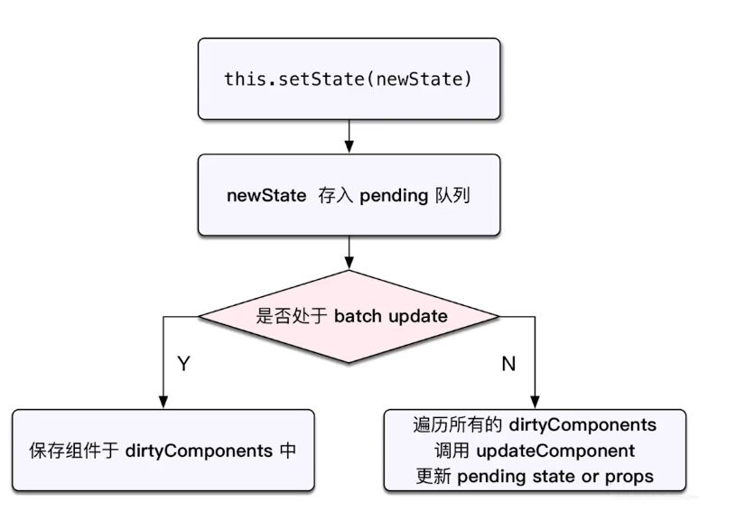

# React原理

## 函数式编程

* 纯函数
* 不可变值

## vdom和diff

Vue和React是数据驱动视图，虚拟dom和diff算法有效控制DOM操作，优化性能。

vdom使用普通的JavaScript对象来描述DOM元素，因为JS计算比DOM操作快，在vdom上描述DOM操作更快，vdom使用diff算法计算需要更新的节点，实现最小化DOM操作。

树的diff算法时间复杂度O(n^3^)，vdom的diff算法优化到O(n)。

* 只比较同一层级，不跨级比较
* tag不同，直接删掉重建
* tag和key相同，不再深度比较

## JSX本质

JSX是编译语法，本质是通过React.createElement创建虚拟节点，之后再通过patch函数将虚拟节点渲染到网页上。

> React.createElement第一个参数是组件或者代表tag的字符串，第二个参数接收一个对象，对象保存节点的属性，后面的参数代表子节点，也可以使用数组作为第三个参数接收。

## 合成事件

React使用SyntheticEvent作为合成事件，主要有以下原因：

* 兼容性、跨平台
* 事件挂载到root对象(React17前是document)，减少内存消耗，避免频繁解绑
* 方便事件统一管理

## setState

* setState主流程

  

  setState根据isBatchingUpdates变量判断是否命中batchUpdate机制，isBatchingUpdates在进入函数前被React设置为true，执行完函数后设置为false。

* batchUpdate机制

  * 生命周期
  * React中注册的事件

* transaction机制(事务机制)

  像isBatchingUpdates这样在函数前后会执行一些操作称为事务机制。

## 组件渲染过程

1. props state
2. render()生成虚拟节点
3. 挂载虚拟节点

更新

1. setState将组件保存在dirtyComponents中
2. render()生成虚拟节点
3. 挂载虚拟节点

## React-Router原理

React-Router有两种实现方式，hash和browser。

* 基于hash的路由通过监听hashchange事件感知到页面发生变化
* 基于browser的路由通过history提供的api(pushState、replaceState)改变url