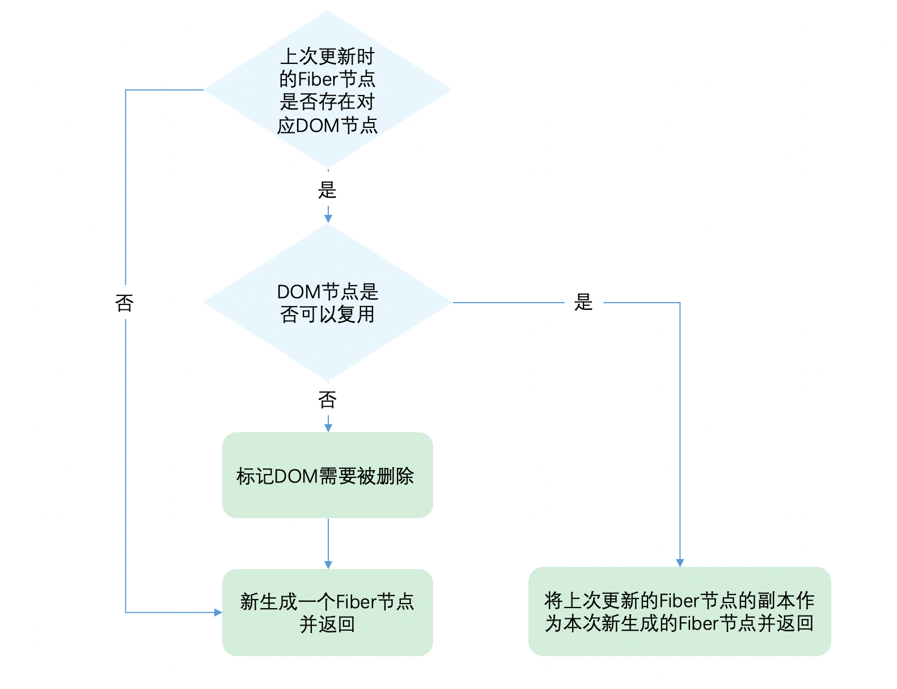

# React源码

当前`React`共有三种模式：

- `legacy`，这是当前`React`使用的方式。当前没有计划删除本模式，但是这个模式可能不支持一些新功能。
- `blocking`，开启部分`concurrent`模式特性的中间模式。目前正在实验中。作为迁移到`concurrent`模式的第一个步骤。
- `concurrent`，面向未来的开发模式。`任务中断/任务优先级`都是针对`concurrent`模式。

**源码目录结构**

- fixtures：为代码贡献者提供的测试React
- packages：主要部分，包含Scheduler，reconciler等
- scripts：react构建相关

下面来看下packages主要包含的模块

- react：核心Api如：React.createElement、React.Component都在这

- 和平台相关render相关的文件夹：

  react-art：如canvas svg的渲染 react-dom：浏览器环境 react-native-renderer：原生相关 react-noop-renderer：调试或者fiber用

- 试验性的包

  react-server: ssr相关

  react-fetch: 请求相关

  react-interactions: 和事件如点击事件相关

  react-reconciler: 构建节点

- shared：包含公共方法和变量

- 辅助包：

  react-is : 判断类型

  react-client: 流相关

  react-fetch: 数据请求相关

react-refresh: 热加载相关

- scheduler：调度器相关
- React-reconciler：在render阶段用它来构建fiber节点

## React架构

React 16架构最大的优势是使用可中断的异步更新代替了同步更新，从而提升了用户交互体验。

在`React15`及以前，`Reconciler`采用递归的方式创建虚拟DOM，递归过程是不能中断的。如果组件树的层级很深，递归会占用线程很多时间，造成卡顿。

在React 16的版本中，将**递归的无法中断的更新**重构为**异步的可中断更新**，采用循环模拟递归。而且比对的过程是利用浏览器的空闲时间完成的，不会长期占用主线程，这就解决了virtualDOM比对造成页面卡顿的问题。

React 16版本的架构可以分为三层:调度层、协调层、渲染层。

* Scheduler(调度层):调度任务的优先级，高优任务优先进入协调器
* Reconciler (协调层)∶构建 Fiber数据结构，比对Fiber对象找出差异，打上不同的Flags记录Fiber对象要进行的DOM操作 
* Renderer(渲染层):负责将发生变化的部分渲染到页面上

### Scheduler调度层

Scheduler存储在packages/scheduler文件夹中。scheduler 是一个任务调度器，它会根据任务的优先级对任务进行调用执行。 如果一个任务执行的时间过长，Scheduler 会中断当前任务，让出线程的执行权，在下一次恢复未完成的任务的执行。

#### 调度过程

1. React 组件状态更新，向 Scheduler 中存入一个任务，该任务为 React 更新算法。
2. Scheduler 调度该任务，执行 React 更新算法。
3. React 在调和阶段更新一个 Fiber 之后，会询问 Scheduler 是否需要暂停。如果不需要暂停，则重复步骤 3，继续更新下一个 Fiber。
4. 如果 Scheduler 表示需要暂停，则 React 将返回一个函数，该函数用于告诉 Scheduler 任务还没有完成。Scheduler 将在未来某时刻调度该任务。

#### 原理

react17 通过**MessageChannel**创建宏任务（不会阻止页面更新），赋予不同任务优先级以及过期时间后加入最小堆队列，通过while循环，每执行一段js就判断是否到时间，如果到了，就继续调度宏任务，等下一帧再执行js，这一帧剩余的时间交给浏览器进行其他工作。

```javascript
function workLoopConcurrent() {
  // Perform work until Scheduler asks us to yield
  while (workInProgress !== null && !shouldYield()) {
    // $FlowFixMe[incompatible-call] found when upgrading Flow
    performUnitOfWork(workInProgress);
  }
}
```

##### MessageChannel

React采用MessageChannel实现时间片切分，将任务放到下一次事件循环中执行。

**setTimeout(fn, 0)问题**

递归执行 `setTimeout(fn, 0)` 时，最后间隔时间会变成 4 毫秒，而不是最初的 1 毫秒。

**requestAnimationFrame问题**

1. 如果上次任务调度不是 `rAF()` 触发的，将导致在当前帧更新前进行两次任务调度。
2. 页面更新的时间不确定，如果浏览器间隔了 10ms 才更新页面，那么这 10ms 就浪费了。

**requestIdleCallback问题**

要实现异步可中断的更新，需要浏览器指定一个时间，如果没有时间剩余了就需要暂停任务。

在window对象中提供了requestldlecallback API，它可以利用浏览器的空闲时间执行任务，但是它自身存在兼容性问题。

在空闲状态下，requestIdleCallback(callback) 回调函数的执行间隔是 50ms（W3C规定）。

**Generator问题**

本身无法在栈中间让出，实现这一功能开销大。本身存在状态，很难在中间恢复状态。

##### shouldYield

React根据fps计算时间片(默认5ms)，开始调度前通过开始时间和时间片计算deadline，执行完任务后判断当前时间是否超过deadline，超过则下一个宏任务中执行。

#### Lane模型

react 17之前的版本用`expirationTime`属性代表优先级，该优先级和IO不能很好的搭配工作（io的优先级高于cpu的优先级），现在有了更加细粒度的优先级表示方法Lane，Lane用二进制位表示优先级，二进制中的1表示位置，同一个二进制数可以有多个相同优先级的位，这就可以表示‘批’的概念，而且二进制方便计算。

### Reconciler协调层

在React 15的版本中，协调器和渲染器交替执行，即找到了差异就直接更新差异。在React 16的版本中，这种情况发生了变化，协调器和渲染器不再交替执行。协调器负责找出差异，在所有差异找出之后，统一交给渲染器进行DOM的更新。也就是说协调器的主要任务就是找出差异部分，并为差异打上标记。

#### fiber使用

Reconciler是更新fiber的过程。每一个 fiber 都可以作为一个执行单元来处理，可以根据自身的过期时间`expirationTime`（ v17 版本叫做优先级 `lane` ）来判断是否还有空间时间执行更新，如果没有时间更新，就要把主动权交给浏览器去渲染。

#### 双缓存树

React 用 workInProgress 树(内存中构建的树) 和 current (渲染树) 来实现更新逻辑。双缓存一个在内存中构建，一个渲染视图，两颗树用 alternate 指针相互指向，在下一次渲染的时候，直接复用缓存树做为下一次渲染树，上一次的渲染树又作为缓存树，这样可以防止只用一颗树更新状态的丢失的情况，又加快了 DOM 节点的替换与更新。

#### render阶段

render阶段包括beginWork和completeWork。

* `beginWork`：是向下调和的过程。就是由 fiberRoot 按照 child 指针逐层向下调和，期间会执行函数组件，实例化类组件，diff 调和子节点，打不同effectTag。
* `completeWork`：是向上归并的过程，如果有兄弟节点，会返回 sibling兄弟，没有则返回 return 父级，一直返回到 fiebrRoot ，期间可以形成effectList，对于初始化流程会创建 DOM ，对于 DOM 元素进行事件收集，处理style，className等。

##### BeginWork

* 对于组件，执行部分生命周期，执行 render ，得到最新的 children (只会处理第一层的儿子，孙子不处理)。
* 向下遍历调和 children ，复用 oldFiber ( diff 算法)。
* 打不同的副作用标签 effectTag ，比如类组件的生命周期，或者元素的增加，删除，更新。

```javascript
function reconcileChildren(current, workInProgress) {
    if (current == null) { // mount
        workInProgress.child = mountChildFibers(...);
    }else {
        workInProgress.child = reconcileChildFibers(...)
    }
}
```

对于第一次mount，会调度children，生成子节点的fiber，并通过child和return指针关联起来。

对于第二次update，会diff children，打上对应的effectTag

##### completeWork

completeWork针对不同`fiber.tag`调用不同的处理逻辑，会分为两个阶段：mount和update。

completeWork上层函数completeUnitOfWork会将存在effectTag的Fiber节点保存在effectList的链表中，该链表以rootFiber.firstEffect为起点。

**mount**

mount时主要逻辑包含三个：

- 为`Fiber节点`生成对应的`DOM节点`
- 将子孙`DOM节点`插入刚生成的`DOM节点`中
- 处理props，初始化事件监听及内部属性

**update**

update时会diff props，处理完的需要更新的props会赋值给`workInProgress.updateQueue`，并最终会在`commit阶段`被渲染在页面上。

> 其中`updatePayload`为数组形式，他的偶数索引的值为变化的`prop key`，奇数索引的值为变化的`prop value`。

* `onClick`、`onChange`等回调函数的注册
* 处理`style prop`
* 处理`DANGEROUSLY_SET_INNER_HTML prop`
* 处理`children prop`

### Renderer渲染层

commit阶段发生在渲染层，遍历effectList执行对应的dom操作或部分生命周期。不同平台对应的Renderer不同，例如浏览器对应的就是react-dom。

在`rootFiber.firstEffect`上保存了一条需要执行`副作用`的`Fiber节点`的单向链表`effectList`，这些`Fiber节点`的`updateQueue`中保存了变化的`props`。

commit阶段，主要遍历effectList，执行相应的副作用和生命周期函数，分为三个阶段：

* before-mutation（执行DOM操作前）
* mutation（执行DOM操作）
* layout（执行DOM操作后）

`commitRootImpl`方法中直到第一句`if (firstEffect !== null)`之前属于`before mutation`之前，这时会做变量赋值，状态重置的工作。

#### before-mutation

遍历`effectList`并调用`commitBeforeMutationEffects`，分为三个部分：

* 处理`DOM节点`渲染/删除后的 `autoFocus`、`blur` 逻辑。
* 调用`getSnapshotBeforeUpdate`生命周期钩子。
* 调度`useEffect`。

```js
// 调度useEffect
if ((effectTag & Passive) !== NoEffect) {
  if (!rootDoesHavePassiveEffects) {
    rootDoesHavePassiveEffects = true;
    scheduleCallback(NormalSchedulerPriority, () => {
      // 触发useEffect
      flushPassiveEffects();
      return null;
    });
  }
}
```

`useEffect`异步执行的原因主要是防止同步执行时阻塞浏览器渲染。异步调度分为三步：

1. `before mutation`阶段在`scheduleCallback`中调度`flushPassiveEffects`
2. `layout`阶段之后将`effectList`赋值给`rootWithPendingPassiveEffects`
3. `scheduleCallback`触发`flushPassiveEffects`，`flushPassiveEffects`内部遍历`rootWithPendingPassiveEffects`

#### mutation

`mutation阶段`也是遍历`effectList`，执行函数。这里执行的是`commitMutationEffects`，分为三个操作。

1. 根据`ContentReset effectTag`重置文字节点
2. 更新current Fiber的`ref`
3. 根据`effectTag`分别处理，其中`effectTag`包括(`Placement` | `Update` | `Deletion` | `Hydrating`)

##### Placement effect

当`Fiber节点`含有`Placement effectTag`，意味着该`Fiber节点`对应的`DOM节点`需要插入到页面中。调用的方法为`commitPlacement`，分为三步：

1. 获取父级DOM节点
2. 获取`Fiber节点`的`DOM`兄弟节点
3. 根据`DOM`兄弟节点是否存在决定调用`parentNode.insertBefore`或`parentNode.appendChild`执行`DOM`插入操作。

##### update effect

当`Fiber节点`含有`Update effectTag`，意味着该`Fiber节点`需要更新。调用的方法为`commitWork`，他会根据`Fiber.tag`分别处理。

当`fiber.tag`为`FunctionComponent`，会调用`commitHookEffectListUnmount`。该方法会遍历`effectList`，执行所有`useLayoutEffect hook`的销毁函数。

当`fiber.tag`为`HostComponent`，会调用`commitUpdate`，将`updateQueue`对应的内容渲染在页面上。

##### Deletion effect

当`Fiber节点`含有`Deletion effectTag`，意味着该`Fiber节点`对应的`DOM节点`需要从页面中删除。调用的方法为`commitDeletion`。

* 递归调用`Fiber`节点及其子孙节点中`fiber.tag`为`ClassComponent`的`componentWillUnmount`
* 移除对应的`DOM`节点
* 解绑`ref`
* 调度`useEffect`的销毁函数

#### layout

`layout阶段`也是遍历`effectList`，执行`commitLayoutEffects`函数。

* current Fiber树交换
* commitLayoutEffectOnFiber（调用`生命周期钩子`和`hook`相关操作）
* commitAttachRef（赋值nextEffect的 ref）

##### commiLayoutEffectOnFiber

`commitLayoutEffectOnFiber`方法会根据`fiber.tag`对不同类型的节点分别处理。

- 对于`ClassComponent`，他会通过`current === null?`区分是`mount`还是`update`，调用`componentDidMount` 或`componentDidUpdate` 。

  触发`状态更新`的`this.setState`如果赋值了第二个参数`回调函数`，也会在此时调用。

- 对于`FunctionComponent`及相关类型，他会调用`useLayoutEffect hook`的`回调函数`，调度`useEffect`的`销毁`与`回调`函数

##### commitAttachRef

```js
function commitAttachRef(finishedWork: Fiber) {
  const ref = finishedWork.ref;
  if (ref !== null) {
    const instance = finishedWork.stateNode;

    // 获取DOM实例
    let instanceToUse;
    switch (finishedWork.tag) {
      case HostComponent:
        instanceToUse = getPublicInstance(instance);
        break;
      default:
        instanceToUse = instance;
    }

    if (typeof ref === "function") {
      // 如果ref是函数形式，调用回调函数
      ref(instanceToUse);
    } else {
      // 如果ref是ref实例形式，赋值ref.current
      ref.current = instanceToUse;
    }
  }
}
```

## 核心流程

### diff算法

由于`Diff`操作本身也会带来性能损耗，React文档中提到，即使在最前沿的算法中，将前后两棵树完全比对的算法的复杂程度为 O(n 3 )，其中`n`是树中元素的数量。

为了降低算法复杂度，`React`的`diff`会预设三个限制：

1. 只对同级元素进行`Diff`。如果一个`DOM节点`在前后两次更新中跨越了层级，那么`React`不会尝试复用他。
2. 两个不同类型的元素会产生出不同的树。如果元素由`div`变为`p`，React会销毁`div`及其子孙节点，并新建`p`及其子孙节点。
3. 开发者可以通过 `key prop`来暗示哪些子元素在不同的渲染下能保持稳定。

#### 基本概念

1. `current Fiber`。如果该`DOM节点`已在页面中，`current Fiber`代表该`DOM节点`对应的`Fiber节点`。
2. `workInProgress Fiber`。如果该`DOM节点`将在本次更新中渲染到页面中，`workInProgress Fiber`代表该`DOM节点`对应的`Fiber节点`。
3. `DOM节点`本身。
4. `JSX对象`。即`ClassComponent`的`render`方法的返回结果，或`FunctionComponent`的调用结果。`JSX对象`中包含描述`DOM节点`的信息。

`Diff算法`的本质是对比1和4，生成2。

`Diff`的入口函数是`reconcileChildFibers`，该函数会根据`newChild`（即`JSX对象`）类型调用不同的处理函数。

从同级的节点数量将Diff分为两类：

1. 当`newChild`类型为`object`、`number`、`string`，代表同级只有一个节点
2. 当`newChild`类型为`Array`，同级有多个节点

#### 单节点diff



判断节点复用时，React通过先判断`key`是否相同，如果`key`相同则判断`type`是否相同，只有都相同时一个`DOM节点`才能复用。

这里有个细节需要关注下：

- 当`child !== null`且`key相同`且`type不同`时执行`deleteRemainingChildren`将`child`及其兄弟`fiber`都标记删除。
- 当`child !== null`且`key不同`时仅将`child`标记删除。

#### 多节点diff

多个节点diff一定在三种情况之中：

* 节点更新
* 节点新增或减少
* 节点位置变化

`React团队`发现，在日常开发中，相较于`新增`和`删除`，`更新`组件发生的频率更高。所以`Diff`会优先判断当前节点是否属于`更新`。

`Diff算法`的整体逻辑会经历两轮遍历：

第一轮遍历：处理`更新`的节点。

第二轮遍历：处理剩下的不属于`更新`的节点。

##### 第一轮遍历

1. `let i = 0`，遍历`newChildren`，将`newChildren[i]`与`oldFiber`比较，判断`DOM节点`是否可复用。

2. 如果可复用，进行组件更新，`i++`，继续比较`newChildren[i]`与`oldFiber.sibling`，可以复用则继续遍历。

3. 如果不可复用，分两种情况：

   * `key`不同导致不可复用，立即跳出整个遍历，**第一轮遍历结束。**

   * `key`相同`type`不同导致不可复用，会将`oldFiber`标记为`DELETION`，并继续遍历

4. 如果`newChildren`遍历完（即`i === newChildren.length - 1`）或者`oldFiber`遍历完（即`oldFiber.sibling === null`），跳出遍历，**第一轮遍历结束。**

##### 第二轮遍历

第一轮遍历后分为如下4种情况

**`newChildren`与`oldFiber`同时遍历完**

diff结束

**`newChildren`没遍历完，`oldFiber`遍历完**

已有的`DOM节点`都复用了，这时还有新加入的节点，意味着本次更新有新节点插入，我们只需要遍历剩下的`newChildren`为生成的`workInProgress fiber`依次标记`Placement`。

**`newChildren`遍历完，`oldFiber`没遍历完**

意味着本次更新比之前的节点数量少，有节点被删除了。所以需要遍历剩下的`oldFiber`，依次标记`Deletion`。

**`newChildren`与`oldFiber`都没遍历完**

这意味着有节点在这次更新中改变了位置。

##### 处理移动节点

为了快速的找到`key`对应的`oldFiber`，我们将所有还未处理的`oldFiber`存入以`key`为key，`oldFiber`为value的`Map`中。

接下来遍历剩余的`newChildren`，通过`newChildren[i].key`就能在`existingChildren`中找到`key`相同的`oldFiber`。

##### 标记节点移动

既然我们的目标是寻找移动的节点，那么我们需要明确：节点是否移动是以什么为参照物？

我们的参照物是：最后一个可复用的节点在`oldFiber`中的位置索引（用变量`lastPlacedIndex`表示）。

我们用变量`oldIndex`表示`遍历到的可复用节点`在`oldFiber`中的位置索引。如果`oldIndex < lastPlacedIndex`，代表本次更新该节点需要向右移动。

`lastPlacedIndex`初始为`0`，每遍历一个可复用的节点，如果`oldIndex >= lastPlacedIndex`，则`lastPlacedIndex = oldIndex`。

```jsx
// 之前
abcd

// 之后
acdb

===第一轮遍历开始===
a（之后）vs a（之前）  
key不变，可复用
此时 a 对应的oldFiber（之前的a）在之前的数组（abcd）中索引为0
所以 lastPlacedIndex = 0;

继续第一轮遍历...

c（之后）vs b（之前）  
key改变，不能复用，跳出第一轮遍历
此时 lastPlacedIndex === 0;
===第一轮遍历结束===

===第二轮遍历开始===
newChildren === cdb，没用完，不需要执行删除旧节点
oldFiber === bcd，没用完，不需要执行插入新节点

将剩余oldFiber（bcd）保存为map

// 当前oldFiber：bcd
// 当前newChildren：cdb

继续遍历剩余newChildren

key === c 在 oldFiber中存在
const oldIndex = c（之前）.index;
此时 oldIndex === 2;  // 之前节点为 abcd，所以c.index === 2
比较 oldIndex 与 lastPlacedIndex;

如果 oldIndex >= lastPlacedIndex 代表该可复用节点不需要移动
并将 lastPlacedIndex = oldIndex;
如果 oldIndex < lastplacedIndex 该可复用节点之前插入的位置索引小于这次更新需要插入的位置索引，代表该节点需要向右移动

在例子中，oldIndex 2 > lastPlacedIndex 0，
则 lastPlacedIndex = 2;
c节点位置不变

继续遍历剩余newChildren

// 当前oldFiber：bd
// 当前newChildren：db

key === d 在 oldFiber中存在
const oldIndex = d（之前）.index;
oldIndex 3 > lastPlacedIndex 2 // 之前节点为 abcd，所以d.index === 3
则 lastPlacedIndex = 3;
d节点位置不变

继续遍历剩余newChildren

// 当前oldFiber：b
// 当前newChildren：b

key === b 在 oldFiber中存在
const oldIndex = b（之前）.index;
oldIndex 1 < lastPlacedIndex 3 // 之前节点为 abcd，所以b.index === 1
则 b节点需要向右移动
===第二轮遍历结束===

最终acd 3个节点都没有移动，b节点被标记为移动
```

### 事件系统

React事件系统分为事件合成、事件绑定、事件触发三个阶段。

#### 基本概念

##### 存储位置

写在React组件中的事件绑定函数最终会以对象的形式存储在Fiber的`memoizedPros`和`pendingProps`属性中。

##### 绑定位置

* 组件中的事件绑定最终会绑定到`document`（React16，17在root上)。

* 组件对应对应的dom上事件函数替换为空函数。
* React事件可能有多个原生事件与之对应

##### 事件合成

在`react`中，我们绑定的事件`onClick`等，并不是原生事件，而是由原生事件合成的`React`事件，比如 `click`事件合成为`onClick`事件。比如`blur` , `change` , `input` , `keydown` , `keyup`等 , 合成为`onChange`。

意义：

* 统一管理
* 实现全浏览器一致性事件系统，抹平浏览器差异

#### 事件初始化

##### 基本概念

事件插件

```js
const SimpleEventPlugin = {
    eventTypes:{ 
        'click':{ /* 处理点击事件  */
            phasedRegistrationNames:{
                bubbled: 'onClick',       // 对应的事件冒泡 - onClick 
                captured:'onClickCapture' //对应事件捕获阶段 - onClickCapture
            },
            dependencies: ['click'], //事件依赖
            ...
        },
        'blur':{ /* 处理失去焦点事件 */ },
        ...
    }
    extractEvents:function(topLevelType,targetInst,){ /* eventTypes 里面的事件对应的统一事件处理函数，接下来会重点讲到 */ }
}
```

* `namesToPlugins`：事件插件名和事件插件的映射
* `plugins`：所有插件列表
* `registrationNameModules`：记录合成事件名与事件插件的映射
* `registrationNameDependencies`：记录合成事件与对应的原生事件列表

##### 流程

1. `injectEventPluginsByName` 函数注册事件插件，初始化`namesToPlugins`后执行`recomputePluginOrdering`函数
2. `recomputePluginOrdering`函数遍历`namesToPlugins`按照`eventPluginOrder`记录的事件名填充`plugins`，取出事件插件的`eventType`，调用`publishEventForPlugin`函数
3. `publishEventForPlugin`函数形成 `registrationNameModules` 和 `registrationNameDependencies` 对象中的映射关系。

#### 事件绑定

1. 在React，diff DOM元素类型的fiber的props的时候， 如果发现是React合成事件，比如`onClick`，会按照事件系统逻辑单独处理。
2. 根据React合成事件类型，找到对应的原生事件的类型，然后调用判断原生事件类型，大部分事件都按照冒泡逻辑处理，少数事件会按照捕获逻辑处理（比如`scroll`事件）。
3. 调用 addTrappedEventListener 进行真正的事件绑定，绑定在`document`上，`dispatchEvent` 为统一的事件处理函数。

#### 事件触发

1. 首先通过统一的事件处理函数 dispatchEvent,进行批量更新batchUpdate。
2. 然后执行事件对应的处理插件中的`extractEvents`，合成事件源对象,每次React会从事件源开始，从上遍历类型为 hostComponent即 dom类型的fiber,判断props中是否有当前事件比如onClick,最终形成一个事件执行队列，React就是用这个队列，来模拟事件捕获->事件源->事件冒泡这一过程。
3. 最后通过runEventsInBatch执行事件队列，如果发现阻止冒泡，那么break跳出循环，最后重置事件源，放回到事件池中，完成整个流程。

`React 17 `取消事件池复用，也就解决了上述在`setTimeout`打印，找不到`e.target`的问题。

### 状态更新

#### 关键节点

在`React`中，有如下方法可以触发状态更新（排除`SSR`相关）：

- ReactDOM.render
- this.setState
- this.forceUpdate
- useState
- useReducer

这些方法调用的场景各不相同，他们是如何接入同一套**状态更新机制**呢？

答案是：每次`状态更新`都会创建一个保存**更新状态相关内容**的对象，我们叫他`Update`。在`render阶段`的`beginWork`中会根据`Update`计算新的`state`。

触发状态更新 → 创建Update对象 → 从fiber到root (`markUpdateLaneFromFiberToRoot`) →调整更新(`ensureRootIsScheduled`) → render阶段 （`performSyncWorkOnRoot` 或 `performConcurrentWorkOnRoot`）→ commit阶段 (`commitRoot`)

#### update

##### update分类

首先，我们将可以触发更新的方法所隶属的组件分类：

- ReactDOM.render —— HostRoot
- this.setState —— ClassComponent
- this.forceUpdate —— ClassComponent
- useState —— FunctionComponent
- useReducer —— FunctionComponent

可以看到，一共三种组件（`HostRoot` | `ClassComponent` | `FunctionComponent`）可以触发更新。

由于不同类型组件工作方式不同，所以存在两种不同结构的`Update`，其中`ClassComponent`与`HostRoot`共用一套`Update`结构，`FunctionComponent`单独使用一种`Update`结构。

##### update结构

```js
const update: Update<*> = {
  eventTime,
  lane,
  suspenseConfig,
  tag: UpdateState,
  payload: null,
  callback: null,

  next: null,
};
```

- suspenseConfig：`Suspense`相关，暂不关注。
- tag：更新的类型，包括`UpdateState` | `ReplaceState` | `ForceUpdate` | `CaptureUpdate`。
- payload：更新挂载的数据，不同类型组件挂载的数据不同。对于`ClassComponent`，`payload`为`this.setState`的第一个传参。对于`HostRoot`，`payload`为`ReactDOM.render`的第一个传参。

`Fiber节点`上的多个`Update`会组成链表并被包含在`fiber.updateQueue`中。

##### updateQueue

`ClassComponent`与`HostRoot`使用的`UpdateQueue`结构如下：

```js
const queue: UpdateQueue<State> = {
    baseState: fiber.memoizedState,
    firstBaseUpdate: null,
    lastBaseUpdate: null,
    shared: {
      pending: null,
    },
    effects: null,
  };
```

> `UpdateQueue`由`initializeUpdateQueue`方法返回

- baseState：本次更新前该`Fiber节点`的`state`，`Update`基于该`state`计算更新后的`state`。
- `firstBaseUpdate`与`lastBaseUpdate`：本次更新前该`Fiber节点`已保存的`Update`。以链表形式存在，链表头为`firstBaseUpdate`，链表尾为`lastBaseUpdate`。
- `shared.pending`：触发更新时，产生的`Update`会保存在`shared.pending`中形成单向环状链表。当由`Update`计算`state`时这个环会被剪开并连接在`lastBaseUpdate`后面。
- effects：数组。保存`update.callback !== null`的`Update`。

##### update流程

假设有一个`fiber`刚经历`commit阶段`完成渲染。

该`fiber`上有两个由于优先级过低所以在上次的`render阶段`并没有处理的`Update`。他们会成为下次更新的`baseUpdate`。

我们称其为`u1`和`u2`，其中`u1.next === u2`。

```js
fiber.updateQueue.baseUpdate: u1 --> u2
```

现在我们在`fiber`上触发两次状态更新，这会先后产生两个新的`Update`，我们称为`u3`和`u4`。

每个 `update` 都会通过 `enqueueUpdate` 方法插入到 `updateQueue`的`shared.pending` 上，`shared.pending` 会保证始终指向最后一个插入的`update`。

`shared.pending`是环状链表，用图表示为：

```js
fiber.updateQueue.shared.pending:   u4 ──> u3
                                     ^      |                                    
                                     └──────┘
```

更新调度完成后进入`render阶段`。

此时`shared.pending`的环被剪开并连接在`updateQueue.lastBaseUpdate`后面：

```js
fiber.updateQueue.baseUpdate: u1 --> u2 --> u3 --> u4
```

接下来遍历`updateQueue.baseUpdate`链表，以`fiber.updateQueue.baseState`为`初始state`，依次与遍历到的每个`Update`计算并产生新的`state`。

在遍历时如果有优先级低的`Update`会被跳过。

当遍历完成后获得的`state`，就是该`Fiber节点`在本次更新的`state`（源码中叫做`memoizedState`）。

`state`的变化在`render阶段`产生与上次更新不同的`JSX`对象，通过`Diff算法`产生`effectTag`，在`commit阶段`渲染在页面上。

渲染完成后`workInProgress Fiber树`变为`current Fiber树`，整个更新流程结束。

#### 优先级

`状态更新`由`用户交互`产生，用户心里对`交互`执行顺序有个预期。`React`根据`人机交互研究的结果`中用户对`交互`的预期顺序为`交互`产生的`状态更新`赋予不同优先级。

每当需要调度任务时，`React`会调用`Scheduler`提供的方法`runWithPriority`。

该方法接收一个`优先级`常量与一个`回调函数`作为参数。`回调函数`会以`优先级`高低为顺序排列在一个`定时器`中并在合适的时间触发。

优先级最终会反映到`update.lane`变量上。

当先后产生低优先级和高优先级的`Update`后，低优先级的render阶段会被打断，先执行高优先级的更新过程，执行完毕后再重新执行低优先级的更新阶段。这时低优先级的render会被执行两次，导致生命周期函数`componentWillxxx`会触发两次。

##### 保证Update不丢失

`shared.pending`环剪开后会被同时连接在`workInProgress updateQueue.lastBaseUpdate`与`current updateQueue.lastBaseUpdate`后面。

##### 保证状态依赖连续性

当某个`Update`由于优先级低而被跳过时，保存在`baseUpdate`中的不仅是该`Update`，还包括链表中该`Update`之后的所有`Update`。

#### ReactDOM.render过程

##### 创建fiber

首次执行`ReactDOM.render`会创建`fiberRootNode`和`rootFiber`。其中`fiberRootNode`是整个应用的根节点，`rootFiber`是要渲染组件所在组件树的`根节点`。

这一步发生在调用`ReactDOM.render`后进入的`legacyRenderSubtreeIntoContainer`方法中。该方法内部会调用`createFiberRoot`方法完成`fiberRootNode`和`rootFiber`的创建以及关联。并初始化`updateQueue`。

##### 创建Update

`updateContainer`方法创建`Update`来开启一次更新。

#### this.setState

`this.setState`内会调用`this.updater.enqueueSetState`方法。在`enqueueSetState`方法中就是从`创建update`到`调度update`的流程了。

在`this.updater`上，除了`enqueueSetState`外，还存在`enqueueForceUpdate`，当我们调用`this.forceUpdate`时会调用他。除了赋值`update.tag = ForceUpdate;`以及没有`payload`外，其他逻辑与`this.setState`一致。

赋值`update.tag = ForceUpdate`的作用：当某次更新含有`tag`为`ForceUpdate`的`Update`，那么当前`ClassComponent`不会受其他性能优化手段（`shouldComponentUpdate`|`PureComponent`）影响，一定会更新。

### Hooks

`FunctionComponent`对应的`fiber`的`memorizedState`存储hook链表。

#### Hook数据结构

##### dispatcher

组件`mount`时的`hook`与`update`时的`hook`来源于不同的对象，这类对象在源码中被称为`dispatcher`。

```js
// mount时的Dispatcher
const HooksDispatcherOnMount: Dispatcher = {
  useCallback: mountCallback,
  useContext: readContext,
  useEffect: mountEffect,
  useImperativeHandle: mountImperativeHandle,
  useLayoutEffect: mountLayoutEffect,
  useMemo: mountMemo,
  useReducer: mountReducer,
  useRef: mountRef,
  useState: mountState,
  // ...省略
};

// update时的Dispatcher
const HooksDispatcherOnUpdate: Dispatcher = {
  useCallback: updateCallback,
  useContext: readContext,
  useEffect: updateEffect,
  useImperativeHandle: updateImperativeHandle,
  useLayoutEffect: updateLayoutEffect,
  useMemo: updateMemo,
  useReducer: updateReducer,
  useRef: updateRef,
  useState: updateState,
  // ...省略
};
```

在`FunctionComponent` `render`前，会根据`FunctionComponent`对应`fiber`的以下条件区分`mount`与`update`。

```js
current === null || current.memoizedState === null
```

并将不同情况对应的`dispatcher`赋值给全局变量`ReactCurrentDispatcher`的`current`属性。在不正确的场景下，`ReactCurrentDispatcher.current`指向`ContextOnlyDispatcher`，所以调用`useState`实际会调用`throwInvalidHookError`，直接抛出异常。

##### 数据结构

```js
const hook: Hook = {
  memoizedState: null,

  baseState: null,
  baseQueue: null,
  queue: null,

  next: null,
};
```

> `hook`与`FunctionComponent fiber`都存在`memoizedState`属性，不要混淆他们的概念。
>
> - `fiber.memoizedState`：`FunctionComponent`对应`fiber`保存的`Hooks`链表。
> - `hook.memoizedState`：`Hooks`链表中保存的单一`hook`对应的数据。

##### memoizedState

不同类型`hook`的`memoizedState`保存不同类型数据，具体如下：

- useState：对于`const [state, updateState] = useState(initialState)`，`memoizedState`保存`state`的值
- useReducer：对于`const [state, dispatch] = useReducer(reducer, {});`，`memoizedState`保存`state`的值
- useEffect：`memoizedState`保存包含`useEffect回调函数`、`依赖项`等的链表数据结构`effect`。`effect`链表同时会保存在`fiber.updateQueue`中
- useRef：对于`useRef(1)`，`memoizedState`保存`{current: 1}`
- useMemo：对于`useMemo(callback, [depA])`，`memoizedState`保存`[callback(), depA]`
- useCallback：对于`useCallback(callback, [depA])`，`memoizedState`保存`[callback, depA]`。与`useMemo`的区别是，`useCallback`保存的是`callback`函数本身，而`useMemo`保存的是`callback`函数的执行结果

### Virtual Dom

virtual Dom是一种编程方式，它以对象的形式保存在内存中，它描述了我们dom的必要信息，并且用类似react-dom等模块与真实dom同步，这一过程也叫协调(reconciler)，这种方式可以声明式的渲染相应的ui状态。

#### Virtual Dom的优势

* 保证性能下限: 虚拟DOM可以经过diff找出最小差异,然后批量进行patch,这种操作虽然比不上手动优化，但是比起粗暴的DOM操作性能要好很多，因此虚拟DOM可以保证性能下限
* 无需手动操作DOM: 虚拟DOM的diff和patch都是在一次更新中自动进行的,我们无需手动操作DOM,极大提高开发效率
* 可以跨平台，虚拟DOM本质上是JavaScript对象,而DOM与平台强相关,相比之下虚拟DOM可以进行更方便地跨平台操作,例如服务器渲染、移动端开发等等


jsx是React.createElement的语法糖，jsx通过babel转化成React.createElement函数，React.createElement执行之后返回jsx对象，也叫virtual-dom

