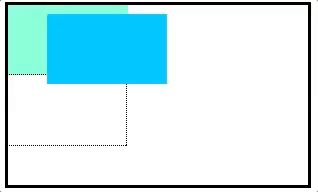

# 定位

### 相对定位

盒子可以相对自己原来的位置进行位置调整，称为相对定位。

通过设置position属性为relative及位置描述词，可以实现相对定位。

* 位置描述词

  left向右移动; right向左移动; top向下移动; bottom向上移动

* 性质

  相对定位的元素，会在“老家留坑”，本质上仍然是在原来的位置，只不过渲染在新的地方而已，渲染的图形可以比喻成“影子”，不会对页面其他元素产生任何影响

* 用途

  1. 微调元素位置
  2. 相对定位的元素可以当做绝对定位的参考盒子

### 绝对定位

绝对定位:盒子可以在浏览器中以坐标进行位置精准描述，拥有自己的绝对位置。

通过设置position属性为absolute及位置描述词，可以实现绝对定位。

* 性质

  * 元素BFC化

  * 破坏性

    如果父容器未设置宽高，那子元素设置绝对定位后将使父容器高度塌陷。

#### 有依赖的绝对定位

绝对定位可以将拥有其余定位属性的父盒子作为基准盒子，通过left、top、right、bottom对其加以限制，控制位置。

* 参考盒子

  绝对定位的盒子会以自己祖先元素中，离自己最近的拥有定位属性的盒子，当做基准点。这个盒子通常是相对定位的，所以这个性质也叫作“子绝父相”

* 绝对定位方位

  绝对定位方位属性是对立(如:left vs right, top vs bottom)的时候，结果不是瞬间位移，而是身体的爆裂拉伸。这种拉伸特性兼容到IE7。拉伸与with、height存在相似的表现。

  * 相互替代性

    设置覆盖遮罩层的方法。

    ```css
    overlay{
        position:absolute;
        width:100%;height:100%;
        left:0;top:0;
    }
    overlay{
        position:absolute;
        left:0;right:0;top:0;bottom:0;
    }
    ```

  * 拉伸更强大

    实现距离右侧200像素的全屏自适应容器层。

    ```css
    overlay{
        position:absolute;left:0;right:200px;
    }
    overlay{
     	postion:absolute;left:0;width:calc(100%-200px);   
    }
    ```

  * 相互支持性

    1. 容器无需固定width/height值，内部元素亦可拉伸;

    2. 容器拉伸，内部元素支持百分比width/height值;

       > 元素百分比height要想其作用需要父级容器的height值不是auto;
       >
       > 即使父级容器的height值是auto ,只要容器绝对定位拉伸形成，百分比高度值也是支持的。

  * 相互合作性

    如果拉伸和width/height同时存在，则width/height设置的尺寸会大于拉伸设置的尺寸。

    当尺寸限制、拉伸以及margin: auto同时出现的时候，就会有绝对定位元素的绝对居中效果，该特性兼容到IE8。

* 垂直居中

  ```css
  selector {
      position:absolute;
  	top:50%;
  	margin-top:-自身高度一半;
  }
  ```

* 用途

  1. 绝对定位用来制作“压盖”、“遮罩”效果
  2. 绝对定位用来结合CSS精灵使用
  3. 绝对定位可以结合JS实现动画

#### 无依赖的绝对定位

不受relative限制的absolute定位，行为表现上是不使用top/right/bottom/left任何一个属性或使用auto作为值。独立的absolute可以摆脱overflow的限制，无论是滚动还是隐藏。

* 行为表现

  * 脱离文档流

    绝对定位元素脱离标准文档流，能够设置宽高

    > 绝对定位的元素脱离标准文档流，将释放自己的位置，对其他元素不会产生任何干扰，而是对它们进行压盖
    >
    > 脱离标准文档流:浮动、绝对定位、固定定位

  * 去浮动

    绝对定位和浮动不能同时存在，绝对定位生效，浮动一定无效。

  * 位置跟随

    元素设置绝对定位后，位置依旧与原先相同。IE7元素设置绝对定位永远是inline-block，不会换行显示。

* 实现相对定位

  无依赖的绝对定位可以配合margin实现精确的相对定位。

  这种实现方法没有多于的relative，代码更简洁，自适应性更强。

  * 图片图标覆盖
  * 下拉框定位
  * 居中边缘定位
  * 星号图标对齐
  
* z-index无依赖

  z-index属性是一个没有单位的正整数，数值大的能够压住数值小的

  1. 如果只有一个绝对定位元素，自然不需要z-index，自动覆盖普通元素;
  2. 如果两个绝对定位，控制DOM流的前后顺序达到需要的覆盖效果，依然无z-index ;
  3. 如果多个绝对定位交错，非常非常少见，z-index : 1控制;
  4. 如果非弹框类的绝对定位元素z-index>2,必定z-index冗余，请优化!

#### 绝对定位与网页整体布局——适合移动web

1. body降级，子元素升级

   ```css
   .page{position:absolute;left:0;top:0;right:0;bottom:0;}
   html,body{height:100%;}
   ```

2. 各模块-头尾、侧边栏(PC端)各居其位

   ```css
   header, footer { position:absolute; left:0; right:0; }
   header { height:48px; top:0; }
   footer { height:52px; bottom:0; }
   aside{width:250px;position:absolute;left:0;top:0;bottom:0;}
   ```

3. 内容区域想象成body

   ```css
   .content{position:absolute;top:48px;bottom:52px;left:250px;overflow:auto;}
   ```

4. 全屏覆盖与page平级

   ```css
   .overlay{position:absolute;top:0;right:0;bottom:0;left:0;
   background-color:rgba(0,0,0,.5);z-index:9;}
   ```

   

### 固定定位

固定定位:不管页面如何卷动，它永远固定在那里。



通过设置position属性为fixed及位置描述词，可以实现固定定位。

* 性质

  脱离标准文档流，只能以页面作为参考点。

* 用途

  1. 返回顶部
  2. 楼层导航