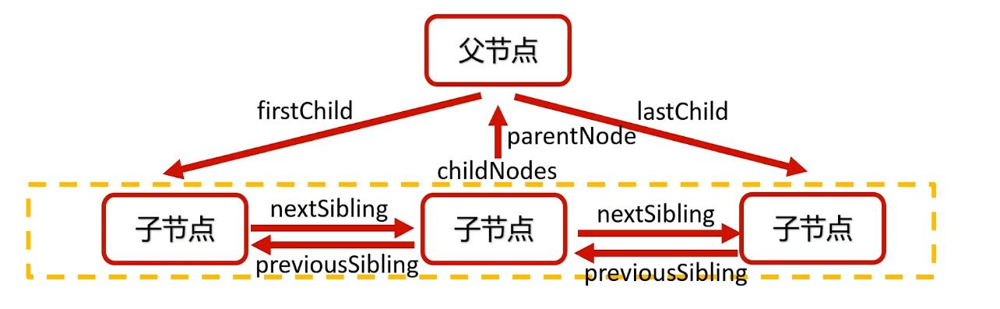

# 节点操作

### 访问元素节点

得到页面上的元素节点是对节点进行操作的前提。访问元素节点主要依靠document对象

#### document

document对象是DOM中最重要的东西，几乎所有DOM的功能都封装在了document对象中

document对象也表示整个HTML文档，它是DOM节点树的根

document对象的nodeType属性值是9

#### 访问元素节点常用方法

| 方法                              | 说明                   | 兼容性 |
| --------------------------------- | ---------------------- | ------ |
| document.getElementById()         | 通过id得到元素         | IE6    |
| document.getElementsByTagName()   | 通过标签名得到元素数组 | IE6    |
| document.getElementsByclassName() | 通过类名得到元素数组   | IE9    |
| document.querySelector()          | 通过选择器得到元素     | IE8+   |
| document.querySelectorAll()       | 通过选择器得到元素数组 | IE8+   |

* 节点元素

  任何一个节点元素也可以调用getElementsByTagName()方法，从而得到其内部的某种类的元素节点
  
* 动态获取

  getElementsByClassName()方法和getElementsByTagName()方法可以动态获取元素，可以理解为:页面上增加或者删除元素时，获取的元素个数可以改变，而iquerySelectorAll()方法做不到此效果。

#### 元素节点的关系

在标准的W3C规范中，空白文本节点也应该算作节点，但是在lE8及以前的浏览器中会有一定的兼容问题，它们不把空文本节点当做节点。从IE9开始支持一些“只考虑元素节点”的属性，从而排除文本节点的干扰。

| 关系           | 所有节点        | 元素节点               |
| -------------- | --------------- | ---------------------- |
| 子节点         | childNodes      | children               |
| 父节点         | parentNode      | 同                     |
| 第一个子节点   | firstChild      | firstElementChild      |
| 最后一个子节点 | lastChild       | lastElementChild       |
| 前一个兄弟节点 | previousSibling | previousElementSibling |
| 后一个兄弟节点 | nextSibling     | nextElementSibling     |

### 改变元素节点内容

改变元素节点中的内容可以使用两个相关属性:innerHTML和 innerText

innerHTML属性能以HTML语法设置节点中的内容

innerText属性只能以纯文本的形式设置节点中的内容

### 改变元素节点样式

1. 调用元素节点的style设置其样式属性的属性值，这种方式是设置了元素的行内样式
2. 改变元素节点的className属性，使已有样式能够作用到元素上。

### 改变元素节点的HTML属性

标准W3C属性，如src、href等等，只需要直接打点进行更改即可

不符合W3C标准的属性，要使用setAttribute()和getAttribute()来设置、读取