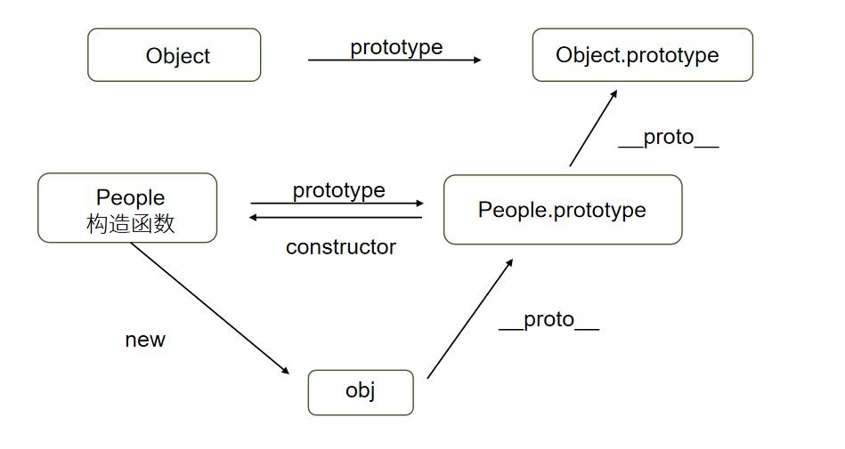

# 原型

任何函数都有prototype属性，prototype是原型的意思。

prototype属性值是个对象，它默认拥有constructor属性指回函数

普通函数来说的prototype属性没有任何用处，而构造函数的prototype属性有用

构造函数的prototype属性是它的实例的原型

### 原型链

原型链查找

JavaScript规定:实例可以打点访问它的原型的属性和方法，这被称为“原型链查找”

原型链遮蔽效应

如果被构造函数创建的对象本身有与和原型相同属性或方法，则调用时不会进行原型链查找。

属性检查

* hasOwnProperty方法可以检查对象是否真正“自己拥有”某属性或者方法

* in运算符只能检查对象的某个属性或方法是否可以被访问。